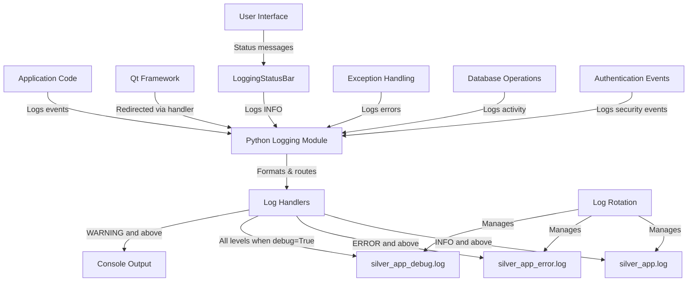

# Logging System Technical Guide - Silver Estimation App

## Architecture

### Overview and Implementation Strategy

The logging architecture replaces ad-hoc print() statements with a structured system built on Python's standard `logging` module, with custom enhancements for PyQt5 integration. This provides consistent error reporting, configurable verbosity levels, secure sensitive information handling, proper exception context, and rotation-based log management.

#### Phased Implementation Approach

**Phase 1: Core Logging Infrastructure**
- Implement setup_logging function
- Add to application startup
- Create LoggingStatusBar
- Initialize Qt message redirection

**Phase 2: Critical Path Logging**
- Add logging to authentication flow
- Implement logging for database operations
- Add logging to estimate saving/loading
- Replace print() statements in core workflows

**Phase 3: Comprehensive Coverage**
- Replace all print() statements with appropriate logging
- Implement context managers for operations
- Add detailed debug logging for troubleshooting
- Complete integration with all UI components

### Example Implementation for Key Components

#### Database Manager Integration

```python
class DatabaseManager:
    def __init__(self, db_path, password):
        self.logger = logging.getLogger(__name__)
        self.logger.info(f"Initializing DatabaseManager for {db_path}")

        try:
            # Existing initialization code...
            self.logger.debug("Database manager initialized successfully")
        except Exception as e:
            self.logger.critical(f"Failed to initialize database manager", exc_info=True)
            raise

    def _encrypt_db(self):
        self.logger.debug(f"Encrypting database to {self.encrypted_db_path}")
        try:
            # Existing encryption code...
            self.logger.info("Database encrypted successfully")
            return True
        except Exception as e:
            self.logger.error("Database encryption failed", exc_info=True)
            return False
```

#### Authentication Flow Integration

```python
def run_authentication():
    logger = logging.getLogger(__name__)
    logger.info("Starting authentication process")

    settings = QSettings("YourCompany", "SilverEstimateApp")
    password_hash = settings.value("security/password_hash")
    backup_hash = settings.value("security/backup_hash")

    if password_hash and backup_hash:
        logger.debug("Found existing password hashes, showing login dialog")
        # Existing login code
        try:
            # Authentication logic
            if success:
                logger.info("Authentication successful")
            else:
                logger.warning("Authentication failed - invalid credentials")
        except Exception as e:
            logger.error("Authentication error", exc_info=True)
    else:
        logger.info("No password hashes found, starting first-time setup")
```

### Configuration Management

#### Log Initialization Function

```python
def setup_logging(app_name="silver_app", log_dir="logs", debug_mode=False):
    """
    Configure the logging system for the Silver Estimation App.

    Args:
        app_name (str): Base name for log files
        log_dir (str): Directory to store log files
        debug_mode (bool): Whether to enable debug logging
    """
    # Create log directory if needed
    log_path = Path(log_dir)
    archived_path = log_path / "archived"
    log_path.mkdir(exist_ok=True)
    archived_path.mkdir(exist_ok=True)

    # Configure root logger
    root_logger = logging.getLogger()
    root_logger.setLevel(logging.DEBUG if debug_mode else logging.INFO)

    # Clear existing handlers
    for handler in root_logger.handlers[:]:
        root_logger.removeHandler(handler)

    # Format and handlers implementation...
    # (Full implementation available in logger.py)
```

#### Environment Variable Support

```python
def get_log_config():
    """Get logging configuration from environment variables or settings."""
    settings = QSettings("YourCompany", "SilverEstimateApp")

    # Environment variables take precedence
    debug_mode = os.environ.get('SILVER_APP_DEBUG', '').lower() in ('true', '1', 'yes')
    if 'SILVER_APP_DEBUG' not in os.environ:
        debug_mode = settings.value("logging/debug_mode", False, type=bool)

    log_dir = os.environ.get('SILVER_APP_LOG_DIR', 'logs')

    # Get log level enable/disable settings
    enable_info = settings.value("logging/enable_info", True, type=bool)
    enable_error = settings.value("logging/enable_critical", True, type=bool)
    enable_debug = settings.value("logging/enable_debug", True, type=bool)

    # Get auto-cleanup settings
    auto_cleanup = settings.value("logging/auto_cleanup", False, type=bool)
    cleanup_days = settings.value("logging/cleanup_days", 7, type=int)

    return {
        'debug_mode': debug_mode,
        'log_dir': log_dir,
        'enable_info': enable_info,
        'enable_error': enable_error,
        'enable_debug': enable_debug,
        'auto_cleanup': auto_cleanup,
        'cleanup_days': cleanup_days
    }
```

#### Runtime Log Reconfiguration

```python
def reconfigure_logging():
    """
    Reconfigure the logging system based on current settings.
    Call this when settings are changed.
    """
    config = get_log_config()

    # Re-initialize logging with new settings
    logger = setup_logging(
        debug_mode=config['debug_mode'],
        log_dir=config['log_dir']
    )

    # Configure cleanup scheduler if enabled
    global _cleanup_scheduler

    if config['auto_cleanup']:
        if _cleanup_scheduler is None:
            _cleanup_scheduler = LogCleanupScheduler(
                log_dir=config['log_dir'],
                cleanup_days=config['cleanup_days']
            )
            _cleanup_scheduler.start()
        else:
            _cleanup_scheduler.update_settings(
                log_dir=config['log_dir'],
                cleanup_days=config['cleanup_days']
            )
    else:
        if _cleanup_scheduler is not None:
            _cleanup_scheduler.stop()
            _cleanup_scheduler = None

    logger.info("Logging system reconfigured")

    return logger
```

### File Structure and Management

```
logs/
├── silver_app.log         # Main application log
├── silver_app_debug.log   # Debug log (when enabled)
├── silver_app_error.log   # Error log
└── archived/              # Rotated logs directory
    ├── silver_app.log.1
    └── ...
```

#### Log Rotation Policy
- Size-based rotation: 5MB per file, 10 backup files
- Compression for older logs
- Configurable cleanup schedules

### Architecture Diagram



## Usage Guide

### Quick Start

#### Basic Logging Setup

```python
import logging

# Get a logger for your module
logger = logging.getLogger(__name__)

# Log at different levels
logger.debug("Detailed information for troubleshooting")
logger.info("Normal operational event")
logger.warning("Potential issue detected")
logger.error("Error that affects functionality")
logger.critical("Application-breaking error")
```

### Log Levels and Usage

| Level | When to Use | Examples |
|-------|-------------|----------|
| **CRITICAL** | Application-breaking errors | Database encryption failure, Authentication failure |
| **ERROR** | Errors affecting functionality | Failed database operations, UI rendering errors |
| **WARNING** | Potential issues | Slow queries, Unexpected data formats |
| **INFO** | Normal events | User login, Estimate creation, Silver bar transfers |
| **DEBUG** | Troubleshooting details | Function entry/exit, Variable values, SQL queries |

#### Practical Examples

**CRITICAL Level:**
```python
try:
    # Critical database operation
    db_manager.perform_backup()
except Exception as e:
    logger.critical(f"Backup failed - system integrity compromised: {str(e)}", exc_info=True)
    sys.exit(1)  # Application cannot continue safely
```

**ERROR Level:**
```python
try:
    self.db_manager.save_estimate(voucher_no, items)
except sqlite3.Error as e:
    logger.error(f"Failed to save estimate {voucher_no}: {str(e)}", exc_info=True)
    QMessageBox.critical(self, "Error", "Failed to save estimate. Check the logs for details.")
```

**WARNING Level:**
```python
query_time = time.time() - start_time
if query_time > 1.0:
    logger.warning(".2f")
```

**INFO Level:**
```python
logger.info(f"User {username} logged in successfully")
logger.info(f"Estimate {voucher_no} created with {len(items)} items and total ${total:.2f}")
```

**DEBUG Level:**
```python
logger.debug(f"Processing silver bar: code={code}, weight={weight}, purity={purity}")
logger.debug(f"Database connection pool status: active={active}, available={available}")
```

### Logging in Application Components

#### UI Component Integration

```python
class EstimateEntryWidget(QWidget):
    def __init__(self, db_manager, parent=None):
        super().__init__(parent)
        self.logger = logging.getLogger(__name__)
        self.logger.info("Initializing EstimateEntryWidget")

    def save_estimate(self):
        try:
            # Save operation
            success = self.db_manager.save_estimate_with_returns(...)
            if success:
                self.logger.info(f"Estimate {voucher_no} saved successfully")
                self.showMessage("Estimate saved successfully", 3000)
            else:
                self.logger.warning(f"Estimate {voucher_no} save completed with warnings")
        except Exception as e:
            self.logger.error(f"Failed to save estimate: {str(e)}", exc_info=True)
```

#### Database Operation Context Manager

```python
class DatabaseOperation:
    """Context manager for database operations with proper logging."""

    def __init__(self, db_manager, operation_name, logger=None):
        self.db_manager = db_manager
        self.operation_name = operation_name
        self.logger = logger or logging.getLogger(__name__)
        self.success = False

    def __enter__(self):
        self.logger.debug(f"Starting database operation: {self.operation_name}")
        return self

    def __exit__(self, exc_type, exc_val, exc_tb):
        if exc_type is None:
            self.logger.debug(f"Completed database operation: {self.operation_name}")
            self.success = True
            return True

        import sqlite3
        if issubclass(exc_type, sqlite3.Error):
            self.logger.error(f"Database error during {self.operation_name}: {str(exc_val)}", exc_info=True)
        elif issubclass(exc_type, ValueError):
            self.logger.warning(f"Value error during {self.operation_name}: {str(exc_val)}", exc_info=True)
        else:
            self.logger.error(f"Unexpected error during {self.operation_name}: {str(exc_val)}", exc_info=True)

        return False

# Usage
with DatabaseOperation(self.db_manager, f"save_estimate_{voucher_no}", logger) as op:
    # Database operations here
    self.db_manager.save_estimate_with_returns(...)

if op.success:
    logger.info(f"Estimate {voucher_no} saved successfully")
```

### Exception Handling Best Practices

#### Pattern for UI Error Handling

```python
try:
    result = self.calculate_estimate()
except ValueError as e:
    logger.error(f"Invalid input in estimate calculation: {str(e)}", exc_info=True)
    QMessageBox.warning(self, "Input Error", f"Please check your input: {str(e)}")
except sqlite3.OperationalError as e:
    logger.error(f"Database operation failed: {str(e)}", exc_info=True)
    QMessageBox.critical(self, "Database Error",
                        "A database error occurred. Your data is safe, but the operation couldn't be completed.")
except Exception as e:
    logger.error(f"Unexpected error in estimate calculation: {str(e)}", exc_info=True)
    QMessageBox.critical(self, "Error",
                        "An unexpected error occurred. Please check the logs for details.")
```

#### Sensitive Data Protection

```python
def sanitize_for_logging(data, sensitive_keys=None):
    """Sanitize potentially sensitive data for logging."""
    if sensitive_keys is None:
        sensitive_keys = ['password', 'key', 'salt', 'hash', 'token', 'secret']

    if not isinstance(data, dict):
        return data

    result = {}
    for key, value in data.items():
        if any(s_key in key.lower() for s_key in sensitive_keys):
            result[key] = '********'
        elif isinstance(value, dict):
            result[key] = sanitize_for_logging(value, sensitive_keys)
        else:
            result[key] = value

    return result

# Usage
user_data = {'username': 'admin', 'password': 'secret123', 'settings': {'theme': 'dark'}}
logger.info(f"User settings: {sanitize_for_logging(user_data)}")
# Logs: User settings: {'username': 'admin', 'password': '********', 'settings': {'theme': 'dark'}}
```

### Configuration via Settings Dialog

1. Access: **Tools → Settings → Logging**
2. **Debug Settings**: Enable debug mode and detailed logging
3. **Log Levels**: Toggle INFO, ERROR/CRITICAL, and DEBUG log types
4. **Automatic Log Cleanup**: Enable automatic deletion of old log files
5. **Manual Cleanup**: Click "Clean Up Logs Now" to immediately remove old files

### Environment Variable Configuration

```bash
# Enable debug logging
set SILVER_APP_DEBUG=true
python main.py

# Custom log directory
set SILVER_APP_LOG_DIR=custom_logs
python main.py
```

### Troubleshooting with Logs

#### Common Log Patterns to Watch For

**Successful Application Startup:**
```
2025-04-29 18:15:23,456 [INFO] [<module>] Silver Estimation App v1.62 starting
2025-04-29 18:15:23,789 [INFO] [setup_logging] Logging initialized
2025-04-29 18:15:24,123 [INFO] [<module>] Creating QApplication instance
```

**Error Indicators:**
```
2025-04-29 18:15:40,123 [ERROR] Database operation failed
2025-04-29 18:15:40,456 [CRITICAL] Authentication system failure
```

#### Analyzing Issues
- Use timestamps to correlate events across log files
- Check `silver_app_error.log` for detailed error information
- Enable debug logging for additional context when troubleshooting
- Look for patterns like repeated warnings or errors

### Advanced Usage

#### Custom Log Handlers

```python
class EmailErrorHandler(logging.Handler):
    """Handler that sends emails for critical errors."""

    def __init__(self, email_address):
        super().__init__(level=logging.CRITICAL)
        self.email_address = email_address

    def emit(self, record):
        message = self.format(record)
        # Send email logic here
        send_email(
            to=self.email_address,
            subject=f"CRITICAL ERROR: {record.getMessage()}",
            body=message
        )

# Add to logging system
email_handler = EmailErrorHandler("admin@example.com")
logging.getLogger().addHandler(email_handler)
```

#### Performance Optimization

```python
# Lazy evaluation for expensive operations
if logger.isEnabledFor(logging.DEBUG):
    logger.debug(f"Complex result: {expensive_calculation()}")

# Sample logging for high-volume operations
import random
if random.random() < 0.01:  # Log only 1% of iterations
    logger.debug(f"Iteration data: {data}")
```

### Security Considerations

- Never log passwords, even hashed ones
- Never log encryption keys or salts
- Never log complete database content
- Use the `sanitize_for_logging()` function consistently
- Set appropriate file permissions on log directories
- Consider log file encryption for sensitive environments