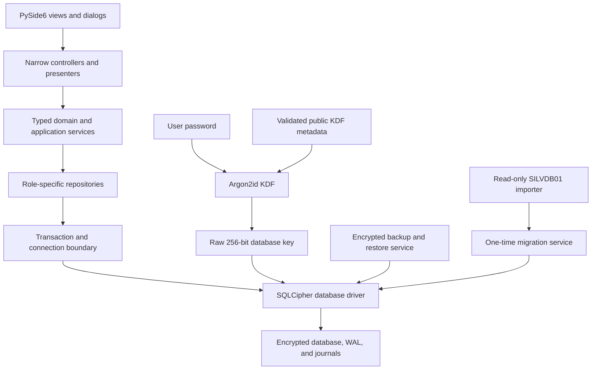
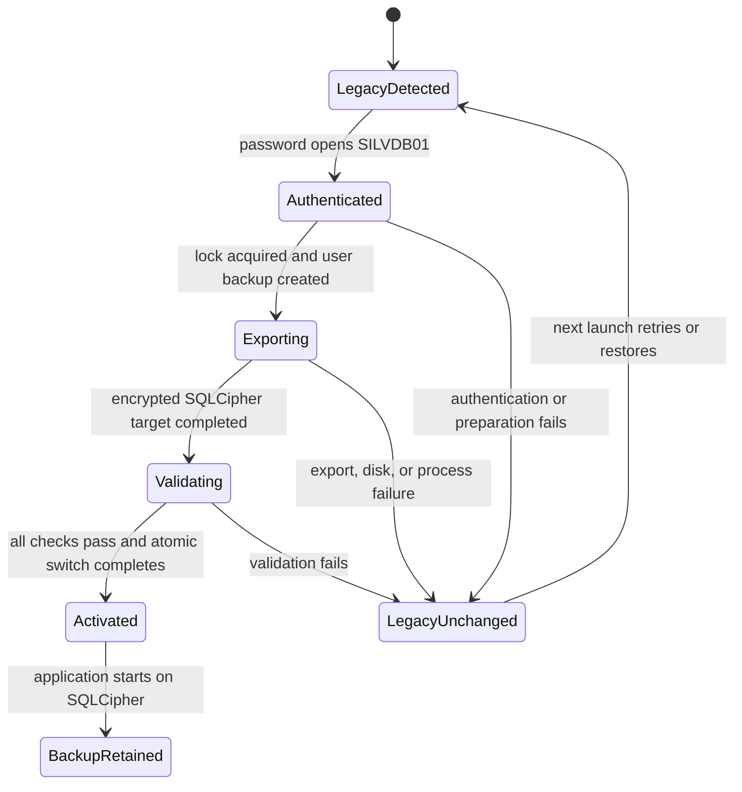

# Modernization and Dependency Replacement Roadmap

**Status:** SQLCipher workstream complete under the bundled-wheel policy
**Last updated:** 2026-07-22
**Applies to:** Silver Estimate v3.07 source tree and later
**Primary platform:** Windows 10/11, Python 3.14
**Project license:** GPL-3.0-only

## Implementation record: 2026-07-22

The live storage cutover is implemented in the source tree. `DatabaseManager`
now opens `estimation.db` directly through `SqlCipherConnectionBroker`; the
plaintext temporary database, encrypted snapshot writer, lifecycle coordinator,
flush scheduler, crash-recovery candidate, and their production modules have
been removed. Repository-facing `conn`/`cursor` compatibility remains while all
secondary readers receive a keyed connection factory.

Implemented security and recovery controls include:

- exact version-1 `estimation.kdf.json` policy (Argon2id, 16-byte salt, time 3,
  65,536 KiB, parallelism 4, 32-byte output) with canonical atomic writes and
  fail-closed parsing;
- raw-key-before-schema connection setup, `cipher_status` authentication,
  SQLCipher 4.17.x enforcement, WAL, `synchronous=NORMAL`, memory-only temp
  storage, `mmap_size=0`, and compile-option verification;
- a marked, one-time plaintext SILVDB01 import workspace, retained and hashed
  `estimation.silvdb01.backup`, typed deterministic row digests, encrypted export,
  integrity/schema validation, and startup cleanup;
- broker maintenance mode, encrypted `.sedbbackup` creation, historical-password
  restore staging and restart activation, copy-and-switch rekey with retained old
  database/metadata, interruption journals, delayed first-run credential commit,
  QLockFile single-instance ownership, and comprehensive wipe;
- active-session plaintext canaries for the database, WAL, SHM, and rollback
  journal, plus integration coverage for wrong keys, weakened metadata, migration,
  rekey, restore, and reader draining.

Verification on 2026-07-22 completed 608 automated tests, the offscreen full
startup smoke, Ruff, mypy, Bandit, 83% total coverage, all performance budgets,
and a clean PyInstaller build whose artifact smoke reported SQLCipher 4.17.0,
OpenSSL, SQLite 3.53.3, and all main, backup, pending, and recovery credential
kinds. The five local encrypted-backup exports ranged from
57.4 to 69.9 ms against the 350 ms gate. A deletion-aware `graphify update .
--force` and live-architecture query resolve database access through
`DatabaseManager` and `SqlCipherConnectionBroker`; neither the removed snapshot
scheduler nor the plaintext temporary database appears on the live path.

The controlled runtime selection is:

| Component | Selected version | Pinned revision |
|---|---|---|
| SQLCipher Community Edition | 4.17.0 | `f9788efa8ac4dfed75c03e4756b1666a1d0845da` |
| `sqlcipher3` binding | `0.6.2+silverestimate.4.17.0.1` | `14fc2632676b20011e0bba64fdda49763a2dd2ec` |
| OpenSSL | 3.6.0 | `f52b9f81a985dc1e45b28cd7b5671feb32815b83` |
| CPython / platform | 3.14 / Windows x64 | release toolchain |

`vendor/sqlcipher/PROVENANCE.json` is authoritative for flags, source tag objects
and peeled commits, licenses, native inventory, wheel name, and SHA-256. The
committed CPython 3.14 Windows x64 wheel has SHA-256
`3edf46a000bde887b311e08f55a418bd4b089896fe2e875a09bacedfb4628702` and is
resolved directly by `pyproject.toml` and `uv.lock`. PR, main, and release CI
verify that exact artifact, probe the installed runtime, and exercise the frozen
executable. Phases 1–3 are complete under this bundled-wheel policy.

The project deliberately does not require byte-for-byte reproduction of the
wheel on every CI run. That level of supply-chain assurance is disproportionate
for this single-user business application. Source compilation remains available
as a manually dispatched candidate workflow; a new candidate must be reviewed,
recorded in provenance, committed, and pass the normal runtime and frozen gates
before it replaces the bundled wheel.

SQLCipher protects page content written to the database, WAL, rollback journal,
and statement journal. It does not protect plaintext already present in process
memory or a compromised account. WAL/journal headers and SHM coordination
metadata may exist without plaintext records. The marked migration workspace is
the sole temporary plaintext exception. User-requested `.seitems.json` exports
remain plaintext and are outside the encrypted-backup guarantee.

## 1. Executive summary

Silver Estimate is in a healthy engineering state: its current lint and type
checks pass, it has Windows packaging and smoke tests, and its core business
rules already have meaningful automated coverage. The roadmap is therefore a
targeted modernization, not a clean-slate rewrite.

The highest-value work is concentrated in four decisions:

1. Replace the live `SILVDB01` snapshot architecture with SQLCipher so the
   SQLite database, WAL, and journals remain encrypted while the application is
   running.
2. Migrate from PyQt6 to PySide6, the official Qt Python binding, after the
   database change has stabilized.
3. Remove Passlib and use `argon2-cffi` directly for password hashing and KDF
   policy.
4. Complete the repository and UI decomposition that has already begun,
   removing compatibility facades instead of building more behavior on them.

The intended steady-state runtime dependency set is small:

- PySide6;
- a pinned and provenance-verified SQLCipher DB-API driver/build;
- `argon2-cffi`;
- `keyring`;
- optionally `httpx` and an SSE parser if the live-rate transport is migrated.

SQLCipher Community Edition is the preferred encryption engine. SQLite SEE is
not selected because its proprietary source and redistribution restrictions
are a poor fit for a GPL-distributed Python application. SQLAlchemy, Alembic,
`aiosqlite`, and a permanent Qt compatibility wrapper are also deliberately
out of scope.

## 2. Goals

This roadmap has the following goals:

- eliminate persistent plaintext SQLite databases, WAL files, and crash
  snapshots during normal operation;
- preserve all existing user data through a verifiable, reversible migration;
- reduce custom security-sensitive storage code;
- adopt the official Qt Python binding without changing user workflows;
- reduce large compatibility facades and `Any`-shaped cross-layer APIs;
- maintain or improve startup, editing, search, printing, and shutdown
  performance;
- keep Windows packaging deterministic and testable;
- make GPL and third-party redistribution compliance part of the release gate;
- preserve the existing strengths: typed domain models, keyset pagination,
  cooperative background work, performance budgets, and frozen-artifact smoke
  testing.

## 3. Non-goals

The following are not objectives of this work:

- changing estimate, inventory, silver-bar, or print business rules;
- replacing SQLite with a client/server database;
- moving the desktop application to a web stack;
- introducing an ORM merely to avoid SQL;
- changing the intentional single-user operating model;
- promising that PySide6 or Nuitka will automatically improve performance or
  binary size;
- claiming protection from malware, keyloggers, an already-compromised Windows
  account, or live process-memory inspection;
- securely erasing data from SSD flash cells or external filesystem snapshots.

## 4. Current baseline and principal problems

### 4.1 Strengths to preserve

- Schema setup and migrations are transactional and validated.
- User-visible collections use bounded keyset pages.
- Background SQLite connections are thread-owned.
- Replaceable UI work uses cooperative cancellation rather than
  `QThread.terminate()`.
- DDA rate data is contract-validated and pinned to a stable item identifier.
- CI exercises linting, typing, tests, coverage, performance, an offscreen UI,
  a Windows executable build, and frozen-artifact startup.
- Estimate printing uses typed documents and direct Qt painters.

### 4.2 Encryption trust-boundary problem

The cryptography inside `SILVDB01` is thoughtfully designed: it uses Argon2id,
AES-256-GCM, authenticated metadata, ordered chunk records, streaming I/O, and
atomic encrypted-file replacement. The primary problem is not an observed
cipher break; it is the storage lifecycle.

On startup, the complete database is decrypted to a temporary plaintext SQLite
file. Normal SQLite work and WAL activity occur against that plaintext file.
Flushes create complete snapshots and encrypt them back into `SILVDB01`.
Recovery can intentionally retain marked plaintext candidates after a failure.
Best-effort overwrite and deletion cannot reliably erase SSD, copy-on-write,
cloud-synchronized, or filesystem-snapshot remnants.

The affected implementation is primarily:

- `security/encrypted_envelope.py`;
- `persistence/encrypted_database_store.py`;
- `persistence/temp_database_store.py`;
- `persistence/flush_scheduler.py`;
- `persistence/database_lifecycle.py`;
- the related portions of `persistence/database_manager.py`.

### 4.3 Qt binding and packaging coupling

PyQt6 imports occur throughout production and test code. Packaging also knows
PyQt-specific directory names, plugin locations, the explicit Qt runtime wheel,
and Passlib hidden imports. A binding change must cover source, tests, type
configuration, plugin pruning, printing, and frozen-artifact validation as one
controlled migration.

### 4.4 Compatibility structures that remain implementation owners

Several components have been named or wrapped as facades but still own too much
implementation:

- `SilverBarsRepository` creates query, command, and synchronization
  repositories, but all three still delegate to a roughly 1,300-line private
  backend in `silver_bars_repository.py`.
- `EstimateEntryFacade` contains hundreds of forwarding methods and is the most
  connected abstraction in the project graph.
- `SettingsDialog` remains a roughly 1,600-line owner of UI construction,
  password changes, log cleanup, print settings, and main-window mutations.
- `PrintPreviewController` remains a roughly 980-line owner of preview UI,
  navigation, printer selection, preferences, PDF export, and printing.

These are the right post-platform refactoring targets because they are
cross-component bridges, not merely large files.

## 5. Target architecture



The target architecture has four important boundaries:

1. UI code depends on application-facing protocols, not concrete repository
   objects or Qt-global settings.
2. Repositories depend on a narrow database protocol, not on a god
   `DatabaseManager` exposing mutable `conn` and `cursor` attributes.
3. SQLCipher owns normal on-disk encryption. Application code does not
   implement database-page encryption or full-database flush scheduling.
4. Legacy `SILVDB01` support is an isolated importer with a defined removal
   date, not an alternative live backend.

## 6. Ordered implementation plan

| Order | Workstream | Release gate | Primary outcome |
|---:|---|---|---|
| 0 | GPL release compliance | Before any public release | Legally complete distribution |
| 1 | SQLCipher feasibility and driver boundary | Before user-data migration | Proven Windows/Python/package support |
| 2 | SILVDB01-to-SQLCipher migration | Before new format becomes default | Reversible, verified data conversion |
| 3 | Encrypted backup, restore, and legacy retirement | Before removing old writer | No plaintext recovery dependency |
| 4 | PyQt6-to-PySide6 migration | After SQLCipher stabilizes | Official Qt binding and simpler Qt dependency policy |
| 5 | Passlib removal | With or immediately after PySide6 | One maintained Argon2 implementation |
| 6 | Real silver-bar repository split | After database protocol exists | Remove private compatibility backend |
| 7 | Estimate-entry composition | After PySide6 | Remove forwarding inheritance and host proxying |
| 8 | Settings decomposition | After password/database services stabilize | Independent pages with typed state |
| 9 | Print/preview decomposition | After PySide6 rendering baseline | Smaller print controllers and one document pipeline |
| 10 | Typed settings, DB, and transaction boundaries | Continuous through phases 1-9 | Fewer `Any` and hidden commits |
| 11 | Shared paged-screen/background infrastructure | After major facades are removed | Less repeated worker/dialog code |
| 12 | HTTP/SSE transport evaluation | Independent, lower urgency | Standard transport behavior if justified |
| 13 | Security-tool rationalization | Before next release pipeline revision | Deterministic advisory and license gates |
| 14 | Packaging benchmark | After PySide6 | Evidence-based PyInstaller/Nuitka choice |
| 15 | Failure, visual, and upgrade testing | Required throughout | Safe migrations and stable user experience |
| 16 | Release hardening and documentation cleanup | Final gate per release | Signed, traceable, supportable artifact |

Orders 1-3 form one database program. They are separated in the table because
each has an independent stop/go decision and rollback point.

## 7. Phase 0: GPL release compliance

### 7.1 Required work

- Keep the repository and package metadata on `GPL-3.0-only`.
- Include the GPL license text in source and binary distributions.
- Add a user-accessible third-party notices file covering Qt/PySide6,
  SQLCipher, Python, OpenSSL or other bundled native components, and all other
  redistributed dependencies.
- Provide a clear source-code location corresponding to each distributed
  release.
- Preserve notices required by SQLCipher's BSD-style license.
- Distribute PySide6/Qt dynamically and satisfy the selected LGPLv3/GPLv3
  obligations for those components.
- Add a CI license-policy gate so a future proprietary or GPL-incompatible
  runtime dependency cannot enter unnoticed.
- Record native libraries from the final executable, not only Python metadata,
  in the release inventory.

### 7.2 Acceptance criteria

- The repository, wheel metadata, README, packaged application, and release
  notes identify the same project license.
- Every shipped dependency has an identified license and notice source.
- The release archive contains the required license and notice material.
- A clean machine can locate the exact corresponding source revision.

This section is operational guidance, not legal advice. Ambiguous linking or
redistribution questions should receive legal review before publication.

## 8. Phases 1-3: SQLCipher database program

### 8.1 Decision

Use SQLCipher rather than SQLite SEE.

SQLCipher provides transparent page-level encryption and encrypts database
pages and SQLite journal/WAL data. Its open-source core uses a BSD-style
license compatible with GPL distribution. The final build must include the
required attribution.

SQLite SEE is rejected for this project because:

- it is proprietary;
- its source cannot be redistributed under the normal SEE license;
- its compiled distribution has restrictions intended to prevent reuse;
- a SEE-linked Python extension inside this GPL application would require a
  formal compatibility analysis and potentially permissions the project does
  not control;
- a custom SEE-enabled SQLite/Python build would increase packaging and support
  burden.

### 8.2 SQLCipher package/build selection gate

Do not begin production migration code until the following spike passes on the
exact supported platform:

- Windows 10 and Windows 11;
- Python 3.14;
- x64 packaged application;
- the selected SQLCipher version and Python DB-API binding;
- development execution and the frozen artifact;
- WAL mode, backup/export, `quick_check`, integrity checking, and rekey;
- current repository CRUD, migration, search, and performance tests.

Selection preference:

1. An officially supported SQLCipher package/build if its cost and terms are
   acceptable.
2. A project-built Community Edition wheel whose SQLCipher and SQLite compile
   options, source revisions, compiler identity, native inventory, and shipped
   artifact hash are recorded by the project. Bit-for-bit rebuild equivalence is
   not a release requirement.
3. A third-party binary wheel only for an initial spike, unless its provenance,
   maintenance, signing, and reproducibility are explicitly accepted.

The application must verify `PRAGMA cipher_version` and required compile
options in tests. Production startup should fail with a clear diagnostic if a
plain SQLite driver is accidentally packaged.

### 8.3 Database protocol boundary

Introduce a small module that owns database-driver selection and connection
configuration. Repositories should not change behavior based on the concrete
module name.

The boundary should expose typed protocols for:

- connection creation;
- transaction begin/commit/rollback;
- cursors and rows;
- backup/export;
- database and cipher integrity checks;
- cancellation/progress hooks for worker-thread queries.

Every connection must be initialized in a fixed order:

1. create the native connection;
2. supply the key before any schema or data query;
3. apply validated cipher compatibility settings, if required;
4. enable foreign keys and required SQLite pragmas;
5. select WAL and in-memory temp storage policies;
6. verify the expected cipher version;
7. expose the connection to repositories.

Keys and key-bearing statements must never be logged. Exceptions must not
include password or key material.

### 8.4 Password-to-key design

Retain Argon2id rather than relying on SQLCipher's default passphrase KDF.

Recommended initial design:

- generate a random salt of at least 16 bytes;
- derive exactly 32 bytes with Argon2id;
- supply those bytes to SQLCipher as a raw key;
- store only the public salt, KDF version, algorithm, and parameters outside
  the encrypted database;
- reject unsupported versions, malformed salts, excessive values that could
  cause resource exhaustion, and parameters below the project's minimum
  policy;
- keep minimum accepted Argon2 parameters in code so an attacker cannot weaken
  the KDF by editing metadata;
- confirm the derived key by opening and authenticating the encrypted database,
  not with an unauthenticated public key-check value.

Suggested metadata shape:

```json
{
  "format": "silverestimate-kdf",
  "version": 1,
  "algorithm": "argon2id",
  "salt_b64": "...",
  "time_cost": 3,
  "memory_cost_kib": 65536,
  "parallelism": 4,
  "key_bytes": 32
}
```

The exact parameters must be benchmarked on the supported machine class. A
wrong password or tampered salt will derive the wrong database key and fail to
open the database. Tampering may cause denial of service but must never lower
the enforced KDF policy.

A random database key wrapped by a password-derived key is an optional later
design. It enables password changes without rekeying every database page, but
it also retains a small application-managed AEAD key-wrapping format. Use it
only if fast independent password rotation is a real requirement; the simpler
direct Argon2id-to-SQLCipher key design is preferred initially.

### 8.5 Single-instance prerequisite

Before migrating or opening the live SQLCipher database, add a process-level
single-instance lock. Prefer Qt's `QLockFile` so no additional runtime
dependency is required.

The lock must:

- be acquired before authentication can mutate the database;
- cover migration, backup, restore, rekey, wipe, and normal runtime;
- identify an active process without silently deleting a valid lock;
- have explicit stale-lock recovery behavior;
- show a user-readable "already running" message;
- be exercised by a packaged-artifact test.

This is particularly important during the one-time migration because two
processes must never attempt to replace the same database file.

### 8.6 File layout and format detection

The canonical live database path may remain `database/estimation.db`. Format
detection must be explicit:

- a file beginning with `SILVDB01` is a legacy encrypted envelope;
- a missing file is a new installation;
- any other existing file is opened only through SQLCipher and must pass cipher
  authentication and schema validation;
- an ordinary plaintext SQLite header at the live production path is rejected
  rather than silently adopted.

Migration files should use explicit sibling names, for example:

```text
estimation.db                    current live file
estimation.db.migrating          incomplete target, never treated as live
estimation.silvdb01.backup       retained pre-migration source
estimation.kdf.json               public KDF metadata
estimation.migration.json         non-secret migration state, if required
```

Names are illustrative and should be centralized rather than duplicated across
controllers or dialogs.

### 8.7 Migration state machine



Migration procedure:

1. Acquire the single-instance lock.
2. Detect and parse the `SILVDB01` header without modifying it.
3. Authenticate the entered password and derive the legacy key.
4. Confirm available disk space for the legacy plaintext export, new encrypted
   database, verification overhead, and retained backup.
5. Copy the original `SILVDB01` file to its retained backup name and verify its
   byte length and digest.
6. Decrypt the legacy database once to a uniquely owned, permission-restricted
   migration directory. This is the only planned plaintext-database use after
   the feature is introduced.
7. Create `estimation.db.migrating` through the SQLCipher driver and set its key
   before schema access.
8. Copy the plaintext database using the SQLCipher-supported backup/export path
   selected by the feasibility spike.
9. Check cipher integrity, SQLite `quick_check`, foreign keys, schema version,
   required tables/indexes, representative row counts, and domain invariants.
10. Close all source and destination connections.
11. Flush the new file and migration metadata as far as Windows permits.
12. Atomically activate the SQLCipher file without overwriting the retained
    legacy backup.
13. Delete the migration plaintext, WAL, SHM, and journal files on a best-effort
    basis.
14. Reopen the activated SQLCipher database through the normal startup path.
15. Record successful migration without storing passwords, keys, or customer
    data in logs.

At every failure before activation, the original legacy file and its backup
must remain usable. An incomplete `.migrating` file must never be promoted on
the basis of presence alone.

### 8.8 Migration validation

Validation must go beyond `quick_check`. At minimum verify:

- expected schema version;
- required tables, columns, indexes, and foreign keys;
- `PRAGMA foreign_key_check` has no rows;
- counts for items, estimates, estimate lines, silver bars, lists, and
  transfers match the source;
- aggregate quantities and monetary totals match within the established exact
  or decimal rules;
- representative vouchers and silver-bar relationships can be read;
- no plaintext canary values are visible in the encrypted database, WAL,
  journal, migration-state files, or application temp directory;
- the frozen artifact can close and reopen the migrated database.

For large tables, use both counts and deterministic chunked digests over stable
column order. Do not log the rows being hashed.

### 8.9 Backup and restore

Backups must remain encrypted from creation through restoration.

Required behavior:

- create a consistent encrypted SQLCipher backup through an online backup or
  approved export operation;
- write to a temporary sibling and atomically publish only after validation;
- include a small non-secret manifest with application version, schema version,
  backup timestamp, cipher format version, and file digest;
- never put the raw key or password in the manifest;
- restore to a new file, validate it, and switch only after all checks pass;
- preserve the pre-restore live database until the restored database reopens;
- make destructive overwrite a deliberate user-confirmed operation;
- test insufficient disk space, cancellation, corrupt backups, wrong passwords,
  and interrupted restore.

The recovery password currently triggers data wipe rather than database unlock.
That semantic should remain explicit in UI and documentation unless a separate
product decision changes it.

### 8.10 Password changes and rekey

With direct password-derived database keys, changing the main password requires
a SQLCipher rekey. The workflow must be treated as a data migration:

1. verify the current password;
2. validate and hash the new login password;
3. derive the new database key;
4. create or verify a current encrypted backup;
5. run rekey without exposing either key in logs;
6. verify cipher integrity and reopen using the new password;
7. update the keyring hash and KDF metadata in a failure-safe order;
8. retain a recovery route if the process stops between database rekey and
   credential update.

The implementation must define the exact ordering before coding. A small
transaction journal containing no key material may be needed to resume safely.

### 8.11 Legacy support and removal schedule

Current migration release status:

- read and migrate `SILVDB01`;
- never create a new live `SILVDB01` database;
- retain the original as `estimation.silvdb01.backup`;
- use SQLCipher exclusively after successful activation;
- keep only the read-only envelope importer in production;
- envelope writing, flush scheduling, the plaintext temp-database runtime, and
  plaintext crash-recovery candidates are already removed.

Installed-system confirmation gate:

- migrate the sole installed system from its actual application directory;
- close and reopen the application successfully against `estimation.db`;
- verify representative estimate, item, and silver-bar data;
- create and validate an encrypted `.sedbbackup`;
- retain a copy of the final release capable of importing SILVDB01.

Retirement release:

- remove the read-only SILVDB01 detection/import path and legacy envelope reader;
- retain a standalone offline conversion tool only if skipped-version upgrades
  must remain supported;
- remove `cryptography` if no approved feature still needs it;
- update security and deployment documentation to describe SQLCipher-only
  runtime support;
- do not automatically delete an existing `estimation.silvdb01.backup`.

Because this installation is currently operated on one system, the maintainer
can confirm migration before removing support. Even so, the retained encrypted
legacy backup should not be deleted automatically without an explicit policy.

### 8.12 SQLCipher acceptance criteria

- No normal application session creates a plaintext database, WAL, SHM,
  journal, or snapshot on disk.
- Wrong passwords and corrupted encrypted files fail closed.
- The original `SILVDB01` file survives every simulated migration failure.
- A successful migration preserves schema, rows, relationships, and calculated
  invariants.
- Startup, save, search, print, backup, restore, password change, shutdown, and
  frozen-artifact tests pass.
- Existing p95 performance budgets continue to pass, or a documented and
  reviewed budget revision explains the measured encryption cost.
- The packaged artifact contains the intended SQLCipher build and no accidental
  plain SQLite production driver.

## 9. Phase 4: PyQt6-to-PySide6 migration

The living, agent-oriented implementation checklist for this phase is maintained
in the [PySide6 migration execution plan](pyside6-migration-execution-plan.md).
That plan owns milestone status, verification evidence, decisions, and handoff
notes; this roadmap remains the source of sequencing and acceptance policy.

### 9.1 Why migrate

PySide6 is the official Qt Python binding and is offered under LGPLv3, GPLv3,
and commercial terms. Since Silver Estimate is now GPL-3.0-only, both PyQt6 and
PySide6 can be used in the current open-source release. The immediate gain is
therefore not escaping GPL; it is using the official binding and simplifying
the Qt dependency/tooling relationship.

Expected gains:

- official Qt-maintained binding and documentation;
- Shiboken tooling for any future C++/Python integration;
- bundled type information, allowing removal of `PyQt6-stubs`;
- removal of the explicit `PyQt6-Qt6` runtime dependency;
- access to `pyside6-deploy`, Qt's Nuitka-based deployment wrapper;
- LGPL/commercial flexibility for the Qt binding if the owner later changes the
  application's licensing strategy and is legally able to relicense the
  application code;
- closer alignment with official Qt examples and issue tracking.

Not guaranteed:

- a smaller executable;
- faster startup or editing;
- identical widget metrics or print output;
- fewer ownership/lifetime issues;
- automatic cross-platform support.

Those outcomes must be measured.

### 9.2 Migration strategy

Do not introduce a permanent `qt_compat.py` layer that hides which binding is
in use. It would preserve dual-binding complexity and weaken type checking.
Perform one controlled binding migration and make PySide6 the only supported
runtime.

Recommended sequence:

1. Freeze representative PyQt6 baselines: application screenshots, window
   geometry, keyboard workflows, generated PDFs, print preview behavior, and
   packaged startup metrics.
2. Replace the runtime and development dependencies in one branch.
3. Mechanically change `PyQt6` imports to `PySide6`.
4. Replace `pyqtSignal`, `pyqtSlot`, and `pyqtProperty` with `Signal`, `Slot`,
   and `Property` where applicable.
5. Review overloaded signals, enum comparisons, `QAction` imports, ownership,
   object deletion, and event-filter return types rather than assuming the
   mechanical changes are sufficient.
6. Change pytest-qt configuration to `pyside6`.
7. Remove PyQt-specific mypy exclusions and the stub dependency; use PySide6's
   shipped typing as the baseline.
8. Update PyInstaller collection/filter logic from `PyQt6/Qt6` paths to the
   actual PySide6 artifact layout.
9. Validate platform, image format, SVG, icon, and print-support plugins.
10. Run the full unit, integration, UI, smoke, performance, build, and frozen
    artifact suites on Windows.
11. Review every screenshot and representative PDF for unintended metric,
    font, pagination, or clipping changes.
12. Update documentation, classifiers, dependency notices, and build scripts.

### 9.3 PySide6-specific risk areas

- QObject ownership and garbage collection can differ from SIP behavior.
- Signal overload selection and implicit conversions may differ.
- Some APIs expose different type names or more precise enums.
- Print preview internals are already customized and require focused testing.
- Font metrics can change line and page breaks even when the Qt version is
  nominally equivalent.
- The PyInstaller plugin tree and exclusions will differ from the current spec.
- Python 3.14 and the chosen PySide6 patch version must be tested together; do
  not rely only on package metadata.

### 9.4 PySide6 acceptance criteria

- No production or test import references PyQt6.
- `pytest-qt` runs with the PySide6 backend.
- Ruff, mypy, all automated tests, performance gates, and smoke screenshots
  pass.
- All user-critical keyboard and table-editing workflows behave identically.
- Classic and Modern estimate PDFs retain approved layout and pagination.
- Silver-bar print and preview workflows remain functional.
- The frozen artifact starts on a clean Windows machine and includes only the
  required Qt modules/plugins.
- Third-party notices and Qt licensing material are present in the release.

## 10. Phase 5: Remove Passlib

### 10.1 Target design

Create a UI-independent password hashing service around
`argon2.PasswordHasher`. It should own:

- current Argon2id hashing parameters;
- password hashing;
- verification;
- mismatch versus malformed-hash handling;
- `check_needs_rehash()` policy;
- opportunistic rehash after successful authentication;
- test fixtures for current and legacy stored hashes.

`LoginDialog` should validate and collect passwords, not implement password
cryptography. `AuthService` should call the password service and persist only
the resulting PHC hash through `CredentialStore`.

### 10.2 Migration

- Capture representative real-format Passlib Argon2id hashes in synthetic test
  fixtures.
- Prove `argon2-cffi` can verify them with the expected semantics.
- On successful verification, rehash only when the new policy requires it.
- Preserve the existing keyring entry names so credential migration is not
  coupled to the library migration.
- Remove `passlib[argon2]`, Passlib mypy exclusions, warning filters, and the
  PyInstaller hidden import.

### 10.3 Acceptance criteria

- Existing supported hashes continue to authenticate.
- Wrong passwords, malformed hashes, and unavailable keyring backends remain
  distinguishable.
- No password hashing code remains in Qt widgets.
- Only one runtime Argon2 package and policy path remains.

## 11. Phases 6-11: architecture completion

### 11.1 Complete the silver-bar repository split

Current state:

- `SilverBarsRepository` is a public facade.
- `SilverBarQueryRepository`, `SilverBarCommandRepository`, and
  `SilverBarSynchronizationRepository` exist.
- Their actual work still delegates to `_SilverBarsRepositoryBackend`.

Target state:

- move SELECT and paging logic into `SilverBarQueryRepository`;
- move list/bar mutations and their transactions into
  `SilverBarCommandRepository`;
- move estimate-to-inventory reconciliation into
  `SilverBarSynchronizationRepository`;
- inject the narrow connection/transaction boundary;
- replace tuple and `Any` returns with typed results;
- migrate call sites to the role they actually use;
- delete `_SilverBarsRepositoryBackend` and then the compatibility facade.

Acceptance criteria:

- no role repository delegates to the old backend;
- UI and services do not receive a broad all-purpose silver-bar repository;
- commit and flush behavior is explicit at command boundaries;
- existing pagination and performance budgets remain valid;
- integration tests cover transaction rollback and synchronization failures.

### 11.2 Replace `EstimateEntryFacade` inheritance with composition

Target ownership:

- `EstimateEntryWidget`: creates and owns visual widgets;
- workflow controller: new/load/save/delete/print orchestration;
- table controller: focus, navigation, edit progression, and row lifecycle;
- totals controller: incremental contribution state and totals publication;
- layout controller: splitter, summary placement, and saved layout preferences;
- presenter/application service: domain calculations and persistence-facing
  operations.

Controllers should depend on narrow view protocols or explicit widget
references. They should not receive a host object whose arbitrary attributes
are forwarded through `__getattr__`, `Any`, or hundreds of pass-through methods.

Acceptance criteria:

- `EstimateEntryWidget` no longer inherits `EstimateEntryFacade`;
- `_host_proxy.py` is removed unless another independently justified use
  remains;
- controllers can be unit-tested without constructing the complete widget;
- no navigation, recalculation, or save behavior regresses;
- the project graph no longer identifies the facade as the dominant bridge.

### 11.3 Split `SettingsDialog`

Create independently testable page widgets/controllers for:

- appearance and table layout;
- printing;
- live rates;
- data, backup, restore, and migration status;
- security and password changes;
- logging and diagnostics.

Each page should expose typed state and signals. A settings coordinator should
handle dirty state, validation, apply, defaults, accept, and reject behavior.
Security and database operations must live in services, not in button handlers.

Acceptance criteria:

- no settings page directly mutates `MainWindow` internals;
- password rekey, backup, restore, and wipe are service calls with explicit
  outcomes;
- settings can be validated before any page applies changes;
- cancel leaves persistent settings and runtime state unchanged;
- the parent dialog becomes navigation and coordination rather than a feature
  owner.

### 11.4 Complete the typed settings boundary

Keep `QSettings`, but isolate it in infrastructure.

Add:

- central key constants or enums;
- dataclasses for appearance, printing, live-rate, logging, and security
  preferences;
- typed defaults and range validation;
- a settings schema version and forward migration functions;
- one load/apply API per settings group;
- test stores implementing the existing reader/store protocols.

Production controllers and services should not use raw string keys or interpret
Qt-specific return types.

### 11.5 Decompose printing and preview

Split `PrintPreviewController` into focused collaborators:

- preview-session controller;
- toolbar/navigation builder;
- printer selection and page setup;
- PDF export;
- preview preference store;
- print execution and user-facing error translation.

Keep Classic and Modern estimate renderers as strategies over the shared typed
`EstimatePrintDocument`. Move silver-bar inventory and list reports toward a
typed document model and direct painter strategy, then remove the legacy HTML
branch when parity is proven.

Acceptance criteria:

- preview, export, and physical printing share the same immutable input model;
- UI state changes do not mutate business records;
- output errors are translated once;
- representative documents pass structural and rasterized golden tests;
- multipage headers, totals, orientations, fonts, and DPI remain correct.

### 11.6 Shared paged-screen and worker infrastructure

History, item-master, and silver-bar screens repeat patterns for search,
pagination, latest-request delivery, selection, loading/empty/error states, and
cooperative shutdown.

Extract reusable infrastructure only after the current screens have narrow
controllers. The shared component must remain generic over request/result types
and must not become another UI god object.

Acceptance criteria:

- stale worker results cannot update closed or superseded views;
- every worker has one documented owner and shutdown path;
- paging cursors remain domain-specific and typed;
- shared code reduces duplication without hiding screen-specific policy.

## 12. Phase 12: HTTP and SSE transport evaluation

The current `urllib` implementation is defensive and tested. Replacing it is a
maintainability option, not an urgent security fix.

Candidate target:

- `httpx` for HTTPS, connection pooling, proxy behavior, certificate handling,
  explicit timeout configuration, and test transports;
- a maintained SSE parser for standards-compliant framing;
- existing DDA schema, stable-item, rate-unit, sequence, reconciliation, cache,
  reconnect, and staleness rules retained as application logic.

Adopt only if the spike demonstrates:

- correct cooperative cancellation from the Qt worker thread;
- no regression in stale-socket detection or fallback polling;
- acceptable frozen-artifact size;
- simpler code after domain validation remains in place;
- deterministic tests without real network calls.

Do not move the entire application to `asyncio` merely to use an HTTP client.
The current dedicated worker-thread model is appropriate for this desktop
application.

## 13. Phase 13: dependency and security-tool policy

### 13.1 Replace Safety with `pip-audit`

Use PyPA's `pip-audit` against the locked project. Configure deterministic JSON
output and a documented vulnerability-ignore process that records advisory ID,
rationale, owner, and expiry.

`pip-audit` can also emit CycloneDX. Decide whether it replaces the separate
CycloneDX tool only after verifying that the resulting SBOM includes the
required application and dependency metadata.

### 13.2 Keep current high-value tools

- Ruff;
- mypy;
- pytest and pytest-qt;
- coverage and changed-line coverage;
- Hypothesis;
- Nox;
- pre-commit;
- Bandit, at least until Ruff security-rule parity is deliberately evaluated;
- the frozen-artifact smoke suite;
- deterministic performance budgets.

### 13.3 Add license and native-component checks

The release pipeline should fail when:

- a runtime dependency has an unknown or disallowed license;
- required attribution is missing;
- a native library in the artifact is absent from the inventory;
- the SQLCipher build identity differs from the approved build;
- the final artifact includes an unintended SQLite or Qt binary;
- the lockfile changed without an accompanying dependency review.

## 14. Phase 14: packaging decision

Keep PyInstaller while SQLCipher and PySide6 are being migrated. Changing the
database engine, Qt binding, and freezer simultaneously would make failures
difficult to isolate.

After PySide6 is stable, compare the current PyInstaller build with
`pyside6-deploy`/Nuitka using the same clean Windows runner.

Measure:

- cold and warm startup;
- time until the first editable control accepts input;
- archive and installed size;
- build time and reproducibility;
- antivirus reputation/false positives;
- one-file extraction behavior;
- SQLCipher, keyring, image, SVG, icon, and print plugin inclusion;
- crash diagnostics and symbol availability;
- ability to sign the executable and installer;
- upgrade and rollback behavior.

Select the new freezer only if it produces a measured operational improvement.
Otherwise retain PyInstaller and replace its PyQt-specific filters with
PySide6-specific filters.

## 15. Phase 15: verification strategy

### 15.1 Required test matrix

| Area | Required cases |
|---|---|
| SQLCipher | new database, reopen, WAL, backup, restore, rekey, wrong key, tamper, corruption |
| Legacy migration | success, wrong password, no space, interruption at each state, validation failure, retry, rollback |
| Plaintext exposure | canaries absent from DB/WAL/journal/temp/backup and packaged runtime artifacts |
| Schema/data | quick check, foreign keys, table/index contract, counts, digests, domain invariants |
| PySide6 | signals, ownership, deletion, dialogs, keyboard navigation, worker shutdown, settings |
| Printing | Classic/Modern, multipage, DPI, orientation, fonts, PDF export, preview, physical-printer abstraction |
| Packaging | clean machine, frozen startup, SQLCipher identity, Qt plugins, keyring backend, single-instance lock |
| Upgrade | existing installation, retained backup, failed upgrade, successful restart, rollback documentation |
| Performance | startup stages, first editable input, save/flush replacement, search, paging, live rate, printing |

### 15.2 No-plaintext canary tests

Seed synthetic records with unique text and numeric markers. During an active
session and after crash simulation, scan only test-owned directories and files
for the exact byte sequences. Cover:

- live database;
- WAL, SHM, rollback and statement journals;
- application temp directories;
- backup files;
- migration metadata;
- logs;
- crash artifacts produced by the application.

This is an application-level regression test, not proof against OS paging,
hibernation, filesystem snapshots, SSD remanence, or process-memory attacks.

### 15.3 Visual and print regression tests

- Keep the current offscreen smoke screenshots.
- Add approved baselines for the login, main estimate, item master, history,
  silver-bar management, and settings screens after PySide6.
- Rasterize representative generated PDFs and compare controlled regions or
  perceptual diffs with documented tolerances.
- Separately assert PDF text content, page count, page size, and required
  section presence so a visually similar but semantically missing document
  fails.
- Pin the Qt patch version used to approve render baselines.

### 15.4 Type and architecture gates

As facades are removed:

- enable `disallow_untyped_defs` globally;
- remove `Any` from repository and controller boundaries;
- eliminate the global `union-attr` suppression;
- remove file-specific complexity exemptions when the owning hotspot is split;
- extend architecture tests so UI cannot import concrete persistence modules
  and domain modules cannot import Qt.

Tighten gates after decomposition, not before. Otherwise the work becomes a
large annotation exercise around structures that are scheduled for deletion.

## 16. Phase 16: release hardening

Every release containing a storage or binding migration should provide:

- a signed Windows executable and, preferably, a signed installer;
- signed checksums;
- an SBOM and third-party notices;
- exact source revision and dependency lockfile;
- migration prerequisites and expected duration;
- automatic encrypted backup before format-changing operations;
- rollback and support instructions;
- known limitations and supported skipped-version upgrade paths;
- release notes that distinguish user-visible changes from internal format
  changes.

The application must never delete the only known-good database as part of
upgrade cleanup.

## 17. Dependency decision matrix

| Current or proposed component | Decision | Timing | Reason |
|---|---|---|---|
| `SILVDB01` live snapshots | Replace with SQLCipher | Immediate program | Eliminate normal plaintext DB/WAL and full snapshot flushes |
| SQLite SEE | Reject | Final | Proprietary distribution and GPL compatibility risk |
| PyQt6 | Replace with PySide6 | After SQLCipher | Official binding and simpler Qt ecosystem alignment |
| `PyQt6-Qt6` | Remove | With PySide6 | PySide6 owns its Qt package relationship |
| `PyQt6-stubs` | Remove | With PySide6 | Use PySide6 typing |
| Passlib | Replace with `argon2-cffi` | With/after PySide6 | Remove duplicated, aging hashing abstraction |
| `argon2-cffi` | Keep | Permanent | Password hashing and raw SQLCipher-key derivation |
| `cryptography` | Keep temporarily | Legacy window | Required by SILVDB01 import; remove if no later key-wrapping need |
| `keyring` | Keep | Permanent | Correct OS credential-vault abstraction |
| `QSettings` | Keep behind typed service | Architecture phases | Suitable for non-secret desktop preferences |
| `urllib` HTTP/SSE | Evaluate replacement | Lower priority | Existing code is robust; standard client may reduce transport code |
| Safety | Replace with `pip-audit` | CI revision | Smaller, open PyPA/OSV-oriented advisory path |
| CycloneDX tool | Keep pending comparison | CI revision | Remove only if replacement SBOM is equivalent |
| PyInstaller | Keep initially | Through PySide6 | Known build path and useful control baseline |
| `pyside6-deploy`/Nuitka | Benchmark | After PySide6 | Switch only on measured improvement |
| SQLAlchemy/Alembic | Do not add | Final | ORM/migration abstraction does not solve local SQLCipher/thread concerns |
| `aiosqlite` | Do not add | Final | Current worker-thread model is appropriate |
| Pydantic for internal models | Do not add presently | Reconsider if external schemas grow | Dataclasses and explicit validation are sufficient |
| OR-Tools | Do not add presently | Reconsider only for scale | Existing DP optimization is smaller and domain-specific |

## 18. Risk register

### 18.1 SQLCipher Python binding supply chain

**Risk:** A convenient wheel may be third-party, stale, incorrectly compiled, or
hard to reproduce.
**Mitigation:** Pin sources and hashes, record compile options, test
`cipher_version`, inventory the frozen binary, and prefer official support or a
controlled build.

### 18.2 Migration interruption

**Risk:** Power loss or process termination could leave ambiguous files.
**Mitigation:** Explicit state names, retained source, write-new/validate/switch
ordering, single-instance lock, idempotent retry, and fault-injection tests.

### 18.3 Password-rekey ordering

**Risk:** Database key and keyring hash can become inconsistent.
**Mitigation:** Specify a recoverable state machine before implementation,
retain encrypted backup, verify new-key reopen before retiring old credentials,
and test every interruption point.

### 18.4 PySide6 semantic differences

**Risk:** Mechanical imports pass but ownership, signals, printing, or widget
metrics regress.
**Mitigation:** Baseline first, review known API differences, run UI and frozen
tests, and visually approve screens/PDFs.

### 18.5 Over-refactoring during platform changes

**Risk:** Combining SQLCipher, PySide6, and UI decomposition obscures defects.
**Mitigation:** Complete them in that order with releasable checkpoints. Avoid
unrelated UI redesign during binding migration.

### 18.6 License drift

**Risk:** A future binary dependency conflicts with GPL or has missing notices.
**Mitigation:** Automated license policy, native artifact inventory, reviewed
lockfile changes, and release notices.

### 18.7 Performance regression

**Risk:** Encryption, KDF, binding, or freezer changes increase startup or
editing latency.
**Mitigation:** Existing p95 budgets, additional time-to-first-edit metric,
before/after artifact benchmarks, and no budget changes without documented
evidence.

## 19. Measurable outcomes

The modernization is successful when:

- no normal runtime plaintext database or SQLite sidecar exists;
- the full legacy migration is reversible until explicitly accepted;
- SILVDB01 writer, snapshot scheduler, and temp recovery code are removed;
- PyQt6, PyQt6's explicit Qt wheel, PyQt6 stubs, and Passlib are absent from the
  lockfile and artifact;
- PySide6 is the only supported Qt binding;
- role-specific silver-bar repositories own their actual implementation;
- `EstimateEntryWidget` uses composition rather than forwarding inheritance;
- settings and print controllers have narrow responsibilities;
- production repository/service APIs do not use broad `Any` contracts;
- all current tests and performance gates pass under the new stack;
- the Windows artifact is signed, inventoried, and carries complete licensing
  material;
- security documentation describes the actual SQLCipher trust boundary and
  does not claim secure deletion or protection from a compromised live system.

## 20. Recommended release sequence

### Release M: encrypted-database migration

- SQLCipher driver and database protocol;
- single-instance lock;
- one-time SILVDB01 migration;
- encrypted backup/restore;
- retained legacy importer and backup;
- migration and no-plaintext tests;
- updated security documentation.

### Release M+1: Qt and password stack

- PySide6-only runtime;
- direct `argon2-cffi` password service;
- PySide6 packaging and visual baselines;
- GPL/Qt/SQLCipher notices and license CI;
- continued read-only SILVDB01 import support.

### Release M+2: compatibility retirement

- after installed-system confirmation, remove the read-only SILVDB01 importer
  and envelope reader; the writer, temporary runtime DB, flush scheduler, and
  plaintext recovery candidates are already absent;
- remove `cryptography` if no approved use remains;
- complete the silver-bar repository split;
- begin estimate-entry and settings composition work.

### Subsequent releases

- complete estimate-entry, settings, and print decomposition;
- tighten typing and complexity gates;
- evaluate HTTP/SSE replacement;
- benchmark `pyside6-deploy`/Nuitka;
- finalize installer signing, upgrade, and rollback automation.

Each release should be independently usable and supportable. Rewrite cost is
not treated as a blocker, but user-data safety and diagnostic isolation still
require staged delivery.

## 21. Definition of done for each workstream

A workstream is complete only when:

1. the target code and migration path are implemented;
2. failure and rollback behavior are automated and tested;
3. affected performance budgets pass;
4. the clean Windows frozen artifact passes;
5. documentation describes the new behavior and removes obsolete claims;
6. dependency, license, SBOM, and packaging metadata are updated;
7. no compatibility layer remains without a named owner and removal release;
8. the old implementation is deleted when its support window ends;
9. the project knowledge graph is updated after code changes;
10. release notes identify any user-visible migration, backup, or recovery step.

## 22. Source map

Primary current implementation references:

- [Project architecture](project-architecture.md)
- [Security architecture](security-architecture.md)
- [Deployment guide](deployment-guide.md)
- [Performance baselines](performance-baseline-thresholds.md)
- [`pyproject.toml`](../pyproject.toml)
- [`SilverEstimate.spec`](../SilverEstimate.spec)
- [`encrypted_envelope.py`](../silverestimate/security/encrypted_envelope.py)
- [`encrypted_database_store.py`](../silverestimate/persistence/encrypted_database_store.py)
- [`temp_database_store.py`](../silverestimate/persistence/temp_database_store.py)
- [`database_manager.py`](../silverestimate/persistence/database_manager.py)
- [`database_lifecycle.py`](../silverestimate/persistence/database_lifecycle.py)
- [`flush_scheduler.py`](../silverestimate/persistence/flush_scheduler.py)
- [`silver_bars_repository.py`](../silverestimate/persistence/silver_bars_repository.py)
- [`estimate_entry_facade.py`](../silverestimate/ui/estimate_entry_facade.py)
- [`settings_dialog.py`](../silverestimate/ui/settings_dialog.py)
- [`print_preview_controller.py`](../silverestimate/ui/print_preview_controller.py)
- [`login_dialog.py`](../silverestimate/ui/login_dialog.py)
- [`dda_rate_stream.py`](../silverestimate/services/dda_rate_stream.py)

External primary references:

- [SQLCipher design](https://www.zetetic.net/sqlcipher/design/)
- [SQLCipher licensing](https://www.zetetic.net/sqlcipher/license/)
- [SQLite SEE license](https://sqlite.org/com/license-see.html)
- [SQLite SEE technical documentation](https://sqlite.org/see/doc/release/www/readme.wiki)
- [Qt for Python](https://doc.qt.io/qtforpython-6/)
- [Qt licensing](https://doc.qt.io/qt-6/licensing.html)
- [`pyside6-deploy`](https://doc.qt.io/qtforpython-6/deployment/deployment-pyside6-deploy.html)
- [`argon2-cffi` API](https://argon2-cffi.readthedocs.io/en/stable/api.html)
- [PyPA `pip-audit`](https://github.com/pypa/pip-audit)
- [GNU GPL FAQ](https://www.gnu.org/licenses/gpl-faq.html)
