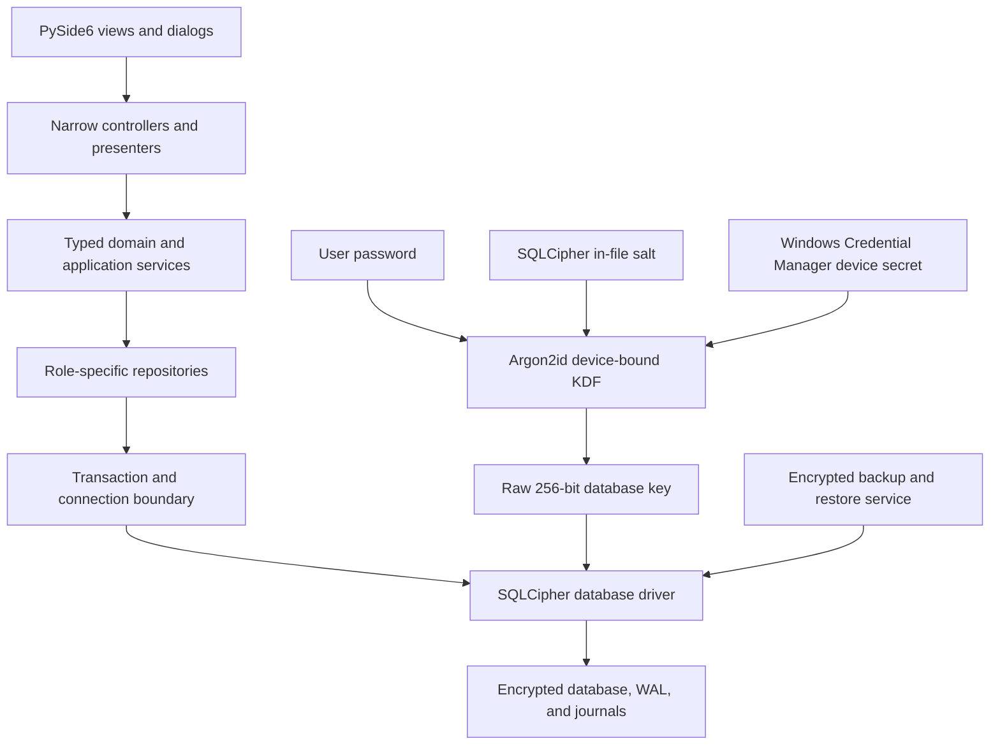
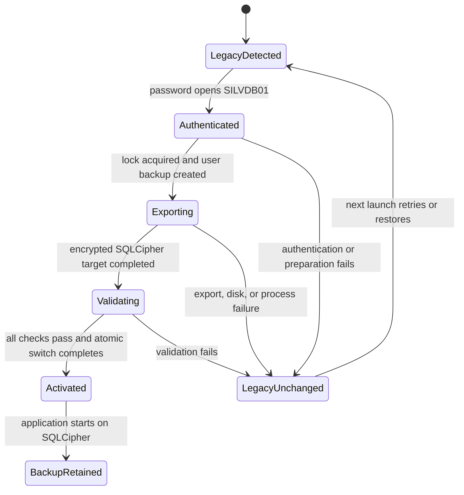

# Modernization and Dependency Replacement Roadmap

**Status:** Modernization closed at v3.12; Phase 12 deferred and Phase 16 out of scope
**Last updated:** 2026-07-30
**Applies to:** Silver Estimate v3.12 source tree and later
**Primary platform:** Windows 10/11, Python 3.14
**Project license:** GPL-3.0-only

## Implementation record: 2026-07-30

The restored roadmap has been reconciled with the v3.12 tree and is now closed
at the accepted product scope. The platform program is complete: the
application is PySide6-only, uses direct
device-bound SQLCipher storage with its salt in the database file, hashes
passwords through `argon2-cffi`, and ships through `pyside6-deploy`/Nuitka.
The temporary plaintext database, snapshot scheduler, legacy SILVDB01 importer,
envelope reader, and `cryptography` dependency are retired.

Phase 6 is complete. `SilverBarQueryRepository`,
`SilverBarCommandRepository`, and `SilverBarSynchronizationRepository` now own
their SQL and transaction behavior directly. `DatabaseManager` exposes the
three narrow repositories, synchronization returns `SilverBarSyncResult`, and
the private backend plus the broad `SilverBarsRepository` facade have been
deleted.

Phase 7 is complete. `EstimateEntryWidget` is a `QWidget` that explicitly owns
workflow, layout, table, and totals controllers. Cross-controller calls name
the target controller, the presenter still receives the narrow
`EstimateEntryView` protocol, and `EstimateEntryFacade` has been deleted.
`HostProxy` remains only because the independently owned silver-bar dialog
controllers still use it.

Phase 8 is complete. `SettingsDialog` is now a navigation and apply/defaults
coordinator over independent appearance, live-rate, printing, data-management,
logging/diagnostics, and security pages. Typed controllers validate settings
before application; password changes and maintenance commands return explicit
service outcomes.

Phase 9 is complete. `PrintPreviewController` is now a composition root over
preview-session, toolbar, navigation, printer/page-setup, preference, and typed
output collaborators. PDF export remains atomic, quick-print validation is
explicit, and preview, export, and printing consume the same immutable payload.

Phase 10 is complete. `ApplicationSettings` is the only production interpreter
of Qt-shaped settings values, every production key is declared by `SettingsKey`,
and schema version 1 provides an ordered forward migration. Settings pages and
runtime consumers use typed reads, range validation, and group state dataclasses;
architecture tests reject raw production key strings and `SettingsService`
escape hatches. `RepositoryDatabase`, `ItemCatalogDatabase`,
`MainCommandsDatabase`, `EstimateDataSource`, and lifecycle protocols replace
`Any` at the affected repository/service boundaries. Repositories no longer
reach into `DatabaseManager` private prepared cursors.

Phase 11 is complete. `PagedLoadState[RowT, CursorT]` now owns page replacement,
append accumulation, loaded/total counts, cursor advancement, reset, and
has-more semantics for Item Master, Estimate History, Silver-Bar History, and
both Silver-Bar Management tables. Query construction, typed cursor selection,
model conversion, selection behavior, loading/empty/error feedback, and
performance telemetry remain with their feature owners. `LatestRequestRunner`
continues to suppress stale generations and now has explicit tests for
idempotent cooperative shutdown and rejection of late submissions.

Current workstream status:

| Phase | Status at v3.12 | Next gate |
|---:|---|---|
| 0-5 | Complete | Preserve release, storage, Qt, and password gates |
| 6 | Complete | Keep role-repository architecture tests green |
| 7 | Complete | Keep widget command/view APIs narrow |
| 8 | Complete | Keep page/controller and typed-outcome architecture tests green |
| 9 | Complete | Keep session/output boundaries and print regression gates green |
| 10 | Complete | Keep typed settings/schema and database-contract architecture tests green |
| 11 | Complete | Keep paging state generic and every worker ownership/shutdown gate green |
| 12 | Deferred | Re-evaluate only if the current DDA transport becomes a maintenance problem |
| 13 | Complete | Keep the locked advisory, license, notice, and native-inventory policy green |
| 14 | Complete | Preserve standalone and one-file artifact inspection |
| 15 | Continuous | Run failure, UI, print, performance, and upgrade gates per change |
| 16 | Out of scope | Revisit only if deployment requirements expand |

There is no remaining implementation phase in the accepted modernization
scope. Phase 12 remains deferred unless the current DDA transport becomes a
demonstrated maintenance problem. Phase 16 is closed as out of scope because
the existing validated portable EXE/ZIP/checksum/SBOM process meets the
project's current single-system deployment requirements. Phase 15 continues as
normal release maintenance.

Verification for this increment: Ruff passes across application, tests, and
release scripts; mypy reports no issues across 146 source files; Bandit reports
no medium/high findings; the locked `pip-audit` report contains no known
vulnerabilities and one approved controlled-wheel skip; and the complete gate
reports 708 non-smoke tests plus the opt-in full-startup smoke passing at 84%
coverage. An environment CycloneDX SBOM augmented with application, CPython,
Qt, SQLCipher, and OpenSSL identity passes the runtime-license and native
component policy. The deletion-aware Graphify refresh reports 5,172 nodes and
11,880 edges. `PagedLoadState` remains the generic paging boundary shared by
four feature owners, while `LatestRequestRunner` remains the execution
boundary.

## Historical implementation record: 2026-07-23

Phase 4 milestones M0 through M8 are complete and the PySide6 migration is on
main. The Windows source, UI, SQLCipher, performance, and `pyside6-deploy`
release gates pass locally. Phase 5 Passlib removal is also complete. Phase 6,
the real silver-bar repository split, is the next workstream.

M1 locked PySide6, Shiboken6, and Qt 6.11.1 with pytest-qt 4.5.0. M2 converted
source and tests to direct PySide6 APIs. M3 resolved signal, context-menu, enum,
and object-lifetime differences. M4 restored every source-quality gate without
a binding suppression. M5 approved the 13-screen visual/keyboard set and nine
representative PDFs.

M6 retired PyInstaller in favor of Qt's `pyside6-deploy` wrapper with Nuitka
4.1.3 and zstandard 0.25.0. The inspected standalone payload contains the
required PySide6/Shiboken6, SQLCipher, Windows platform, icon/SVG/image, style,
and print components with no PyQt6 or second Qt runtime. The one-file artifact
passes frozen Qt, keyring, PDF, SQLCipher, and writable-path smoke checks and a
five-sample startup p95 of 1872.52 ms against the unchanged 3000 ms budget. It
is evaluated directly against the current release contract.

M7 reconciled maintained documentation, licensing, project metadata, release
workflow, and the CycloneDX SBOM. M8 confirmed that no live PyQt6/SIP
dependency, import, compatibility loader, or current user-facing claim remains.
The complete 623-test suite plus startup smoke, quality and performance gates,
SQLCipher provenance, fresh standalone and one-file builds, frozen runtime
smokes, and a ten-sample 2727.15 ms executable-startup p95 all pass locally.

Phase 5 replaced Passlib with a UI-independent password service using
`argon2-cffi` 25.1.0. The service preserves existing Argon2id PHC hashes,
distinguishes mismatch from malformed storage, and persists a replacement hash
after successful verification only when the policy requires rehashing.
`LoginDialog` no longer owns cryptography, keyring entry names are unchanged,
and the deployment contract rejects Passlib from the frozen payload and Nuitka
report. Ruff, mypy, Bandit, 637 tests plus startup smoke, local performance
budgets, 84% coverage, fresh standalone and one-file builds, frozen Argon2id,
keyring, SQLCipher, Qt, SVG, and PDF smokes all pass. The one-file executable's
five-sample startup p95 is 2107.91 ms against the unchanged 3000 ms budget.

## Historical implementation record: 2026-07-22

The live storage cutover is implemented in the source tree. `DatabaseManager`
now opens `estimation.db` directly through `SqlCipherConnectionBroker`; the
plaintext temporary database, encrypted snapshot writer, lifecycle coordinator,
flush scheduler, crash-recovery candidate, and their production modules have
been removed. Repository-facing `conn`/`cursor` compatibility remains while all
secondary readers receive a keyed connection factory.

Implemented security and recovery controls include:

- exact version-1 `estimation.kdf.json` policy (Argon2id, 16-byte salt, time 3,
  65,536 KiB, parallelism 4, 32-byte output) with canonical atomic writes and
  fail-closed parsing;
- raw-key-before-schema connection setup, `cipher_status` authentication,
  SQLCipher 4.17.x enforcement, WAL, `synchronous=NORMAL`, memory-only temp
  storage, `mmap_size=0`, and compile-option verification;
- a marked, one-time plaintext SILVDB01 import workspace, retained and hashed
  `estimation.silvdb01.backup`, typed deterministic row digests, encrypted export,
  integrity/schema validation, and startup cleanup;
- broker maintenance mode, encrypted `.sedbbackup` creation, historical-password
  restore staging and restart activation, copy-and-switch rekey with retained old
  database/metadata, interruption journals, delayed first-run credential commit,
  QLockFile single-instance ownership, and comprehensive wipe;
- active-session plaintext canaries for the database, WAL, SHM, and rollback
  journal, plus integration coverage for wrong keys, weakened metadata, migration,
  rekey, restore, and reader draining.

Verification on 2026-07-22 completed 608 automated tests, the offscreen full
startup smoke, Ruff, mypy, Bandit, 83% total coverage, all performance budgets,
and a clean PyInstaller build whose artifact smoke reported SQLCipher 4.17.0,
OpenSSL, SQLite 3.53.3, and all main, backup, pending, and recovery credential
kinds. The five local encrypted-backup exports ranged from
57.4 to 69.9 ms against the 350 ms gate. A deletion-aware `graphify update .
--force` and live-architecture query resolve database access through
`DatabaseManager` and `SqlCipherConnectionBroker`; neither the removed snapshot
scheduler nor the plaintext temporary database appears on the live path.

The controlled runtime selection is:

| Component | Selected version | Pinned revision |
|---|---|---|
| SQLCipher Community Edition | 4.17.0 | `f9788efa8ac4dfed75c03e4756b1666a1d0845da` |
| `sqlcipher3` binding | `0.6.2+silverestimate.4.17.0.1` | `14fc2632676b20011e0bba64fdda49763a2dd2ec` |
| OpenSSL | 3.6.0 | `f52b9f81a985dc1e45b28cd7b5671feb32815b83` |
| CPython / platform | 3.14 / Windows x64 | release toolchain |

`vendor/sqlcipher/PROVENANCE.json` is authoritative for flags, source tag objects
and peeled commits, licenses, native inventory, wheel name, and SHA-256. The
committed CPython 3.14 Windows x64 wheel has SHA-256
`3edf46a000bde887b311e08f55a418bd4b089896fe2e875a09bacedfb4628702` and is
resolved directly by `pyproject.toml` and `uv.lock`. PR, main, and release CI
verify that exact artifact, probe the installed runtime, and exercise the frozen
executable. Phases 1–3 are complete under this bundled-wheel policy.

The project deliberately does not require byte-for-byte reproduction of the
wheel on every CI run. That level of supply-chain assurance is disproportionate
for this single-user business application. Source compilation remains available
as a manually dispatched candidate workflow; a new candidate must be reviewed,
recorded in provenance, committed, and pass the normal runtime and frozen gates
before it replaces the bundled wheel.

SQLCipher protects page content written to the database, WAL, rollback journal,
and statement journal. It does not protect plaintext already present in process
memory or a compromised account. WAL/journal headers and SHM coordination
metadata may exist without plaintext records. The marked migration workspace is
the sole temporary plaintext exception. User-requested `.seitems.json` exports
remain plaintext and are outside the encrypted-backup guarantee.

## 1. Executive summary

Silver Estimate is in a healthy engineering state: its current lint and type
checks pass, it has Windows packaging and smoke tests, and its core business
rules already have meaningful automated coverage. The roadmap is therefore a
targeted modernization, not a clean-slate rewrite.

The highest-value work is concentrated in four decisions:

1. Replace the live `SILVDB01` snapshot architecture with SQLCipher so the
   SQLite database, WAL, and journals remain encrypted while the application is
   running.
2. Migrate from PyQt6 to PySide6, the official Qt Python binding, after the
   database change has stabilized.
3. Remove Passlib and use `argon2-cffi` directly for password hashing and KDF
   policy.
4. Complete the repository and UI decomposition that has already begun,
   removing compatibility facades instead of building more behavior on them.

The intended steady-state runtime dependency set is small:

- PySide6;
- a pinned and provenance-verified SQLCipher DB-API driver/build;
- `argon2-cffi`;
- `keyring`;
- optionally `httpx` and an SSE parser if the live-rate transport is migrated.

SQLCipher Community Edition is the preferred encryption engine. SQLite SEE is
not selected because its proprietary source and redistribution restrictions
are a poor fit for a GPL-distributed Python application. SQLAlchemy, Alembic,
`aiosqlite`, and a permanent Qt compatibility wrapper are also deliberately
out of scope.

## 2. Goals

This roadmap has the following goals:

- eliminate persistent plaintext SQLite databases, WAL files, and crash
  snapshots during normal operation;
- preserve all existing user data through a verifiable, reversible migration;
- reduce custom security-sensitive storage code;
- adopt the official Qt Python binding without changing user workflows;
- reduce large compatibility facades and `Any`-shaped cross-layer APIs;
- maintain or improve startup, editing, search, printing, and shutdown
  performance;
- keep Windows packaging deterministic and testable;
- make GPL and third-party redistribution compliance part of the release gate;
- preserve the existing strengths: typed domain models, keyset pagination,
  cooperative background work, performance budgets, and frozen-artifact smoke
  testing.

## 3. Non-goals

The following are not objectives of this work:

- changing estimate, inventory, silver-bar, or print business rules;
- replacing SQLite with a client/server database;
- moving the desktop application to a web stack;
- introducing an ORM merely to avoid SQL;
- changing the intentional single-user operating model;
- promising that PySide6 or Nuitka will automatically improve performance or
  binary size;
- claiming protection from malware, keyloggers, an already-compromised Windows
  account, or live process-memory inspection;
- securely erasing data from SSD flash cells or external filesystem snapshots.

## 4. Baseline and principal problems

### 4.1 Strengths to preserve

- Schema setup and migrations are transactional and validated.
- User-visible collections use bounded keyset pages.
- Background SQLite connections are thread-owned.
- Replaceable UI work uses cooperative cancellation rather than
  `QThread.terminate()`.
- DDA rate data is contract-validated and pinned to a stable item identifier.
- CI exercises linting, typing, tests, coverage, performance, an offscreen UI,
  a Windows executable build, and frozen-artifact startup.
- Estimate printing uses typed documents and direct Qt painters.

### 4.2 Encryption trust-boundary problem: resolved

The original `SILVDB01` design decrypted the database to a temporary plaintext
SQLite file and re-encrypted complete snapshots. That lifecycle, rather than an
observed cipher break, created the trust-boundary problem.

The v3.11 runtime opens the live SQLCipher database directly. The database,
WAL, and rollback journal use the approved SQLCipher build; no application
snapshot flush exists. A random device secret from Windows Credential Manager
is combined with the password-derived material, and the 16-byte SQLCipher salt
is read from the database file. The old envelope, temporary-runtime,
scheduler, lifecycle, and importer modules are deleted. Historical records
below retain their names only to document the completed migration.

### 4.3 Qt binding and packaging coupling: resolved

Production and tests are PySide6-only. Packaging uses a committed
`pysidedeploy.spec`, Nuitka, and inspected standalone/one-file payloads. PyQt6,
its explicit Qt wheel, SIP, PyQt stubs, PyInstaller, and Passlib are absent from
the active dependency and packaging paths.

### 4.4 Remaining implementation owners

The silver-bar backend/facade and estimate-entry forwarding inheritance have
been removed. `SettingsDialog` now coordinates six independently owned pages;
password changes, data actions, logging/diagnostics, and printing settings have
their own controllers or services. `PrintPreviewController` remains a roughly
980-line owner of preview UI, navigation, printer selection, preferences, PDF
export, and printing. It is the next post-platform refactoring target because
it is a cross-component bridge, not merely a large file.

## 5. Target architecture


```mermaid
flowchart TD
    UI["PySide6 views and dialogs"] --> C["Narrow controllers and presenters"]
    C --> D["Typed domain and application services"]
    D --> R["Role-specific repositories"]
    R --> TX["Transaction and connection boundary"]
    TX --> SC["SQLCipher database driver"]
    SC --> DB["Encrypted database, WAL, and journals"]

    PW["User password"] --> KDF["Argon2id device-bound KDF"]
    SALT["SQLCipher in-file salt"] --> KDF
    DEVICE["Windows Credential Manager device secret"] --> KDF
    KDF --> KEY["Raw 256-bit database key"]
    KEY --> SC

    BK["Encrypted backup and restore service"] --> SC
```

The target architecture has four important boundaries:

1. UI code depends on application-facing protocols, not concrete repository
   objects or Qt-global settings.
2. Repositories depend on a narrow database protocol, not on a god
   `DatabaseManager` exposing mutable `conn` and `cursor` attributes.
3. SQLCipher owns normal on-disk encryption. Application code does not
   implement database-page encryption or full-database flush scheduling.
4. Device binding is owned by the security/storage boundary; no legacy
   envelope or alternate live backend remains.

## 6. Ordered implementation plan

| Order | Workstream | Release gate | Primary outcome |
|---:|---|---|---|
| 0 | GPL release compliance | Before any public release | Legally complete distribution |
| 1 | SQLCipher feasibility and driver boundary | Before user-data migration | Proven Windows/Python/package support |
| 2 | SILVDB01-to-SQLCipher migration | Before new format becomes default | Reversible, verified data conversion |
| 3 | Encrypted backup, restore, and legacy retirement | Before removing old writer | No plaintext recovery dependency |
| 4 | PyQt6-to-PySide6 migration | After SQLCipher stabilizes | Official Qt binding and simpler Qt dependency policy |
| 5 | Passlib removal | With or immediately after PySide6 | One maintained Argon2 implementation |
| 6 | Real silver-bar repository split | After database protocol exists | Remove private compatibility backend |
| 7 | Estimate-entry composition | After PySide6 | Remove forwarding inheritance and host proxying |
| 8 | Settings decomposition | After password/database services stabilize | Independent pages with typed state |
| 9 | Print/preview decomposition | After PySide6 rendering baseline | Smaller print controllers and one document pipeline |
| 10 | Typed settings, DB, and transaction boundaries | Continuous through phases 1-9 | Fewer `Any` and hidden commits |
| 11 | Shared paged-screen/background infrastructure | After major facades are removed | Less repeated worker/dialog code |
| 12 | HTTP/SSE transport evaluation | Independent, lower urgency | Standard transport behavior if justified |
| 13 | Security-tool rationalization | Before next release pipeline revision | Deterministic advisory and license gates |
| 14 | `pyside6-deploy` packaging cutover | After PySide6 | Curated Nuitka standalone and one-file release artifacts |
| 15 | Failure, visual, and upgrade testing | Required throughout | Safe migrations and stable user experience |
| 16 | Release hardening and documentation cleanup | Final gate per release | Signed, traceable, supportable artifact |

Orders 1-3 form one database program. They are separated in the table because
each has an independent stop/go decision and rollback point.

## 7. Phase 0: GPL release compliance

### 7.1 Required work

- Keep the repository and package metadata on `GPL-3.0-only`.
- Include the GPL license text in source and binary distributions.
- Add a user-accessible third-party notices file covering Qt/PySide6,
  SQLCipher, Python, OpenSSL or other bundled native components, and all other
  redistributed dependencies.
- Provide a clear source-code location corresponding to each distributed
  release.
- Preserve notices required by SQLCipher's BSD-style license.
- Distribute PySide6/Qt dynamically and satisfy the selected LGPLv3/GPLv3
  obligations for those components.
- Add a CI license-policy gate so a future proprietary or GPL-incompatible
  runtime dependency cannot enter unnoticed.
- Record native libraries from the final executable, not only Python metadata,
  in the release inventory.

### 7.2 Acceptance criteria

- The repository, wheel metadata, README, packaged application, and release
  notes identify the same project license.
- Every shipped dependency has an identified license and notice source.
- The release archive contains the required license and notice material.
- A clean machine can locate the exact corresponding source revision.

This section is operational guidance, not legal advice. Ambiguous linking or
redistribution questions should receive legal review before publication.

## 8. Phases 1-3: SQLCipher database program

### 8.1 Decision

Use SQLCipher rather than SQLite SEE.

SQLCipher provides transparent page-level encryption and encrypts database
pages and SQLite journal/WAL data. Its open-source core uses a BSD-style
license compatible with GPL distribution. The final build must include the
required attribution.

SQLite SEE is rejected for this project because:

- it is proprietary;
- its source cannot be redistributed under the normal SEE license;
- its compiled distribution has restrictions intended to prevent reuse;
- a SEE-linked Python extension inside this GPL application would require a
  formal compatibility analysis and potentially permissions the project does
  not control;
- a custom SEE-enabled SQLite/Python build would increase packaging and support
  burden.

### 8.2 SQLCipher package/build selection gate

Do not begin production migration code until the following spike passes on the
exact supported platform:

- Windows 10 and Windows 11;
- Python 3.14;
- x64 packaged application;
- the selected SQLCipher version and Python DB-API binding;
- development execution and the frozen artifact;
- WAL mode, backup/export, `quick_check`, integrity checking, and rekey;
- current repository CRUD, migration, search, and performance tests.

Selection preference:

1. An officially supported SQLCipher package/build if its cost and terms are
   acceptable.
2. A project-built Community Edition wheel whose SQLCipher and SQLite compile
   options, source revisions, compiler identity, native inventory, and shipped
   artifact hash are recorded by the project. Bit-for-bit rebuild equivalence is
   not a release requirement.
3. A third-party binary wheel only for an initial spike, unless its provenance,
   maintenance, signing, and reproducibility are explicitly accepted.

The application must verify `PRAGMA cipher_version` and required compile
options in tests. Production startup should fail with a clear diagnostic if a
plain SQLite driver is accidentally packaged.

### 8.3 Database protocol boundary

Introduce a small module that owns database-driver selection and connection
configuration. Repositories should not change behavior based on the concrete
module name.

The boundary should expose typed protocols for:

- connection creation;
- transaction begin/commit/rollback;
- cursors and rows;
- backup/export;
- database and cipher integrity checks;
- cancellation/progress hooks for worker-thread queries.

Every connection must be initialized in a fixed order:

1. create the native connection;
2. supply the key before any schema or data query;
3. apply validated cipher compatibility settings, if required;
4. enable foreign keys and required SQLite pragmas;
5. select WAL and in-memory temp storage policies;
6. verify the expected cipher version;
7. expose the connection to repositories.

Keys and key-bearing statements must never be logged. Exceptions must not
include password or key material.

### 8.4 Password-to-key design

Retain Argon2id rather than relying on SQLCipher's default passphrase KDF.

Recommended initial design:

- generate a random salt of at least 16 bytes;
- derive exactly 32 bytes with Argon2id;
- supply those bytes to SQLCipher as a raw key;
- store only the public salt, KDF version, algorithm, and parameters outside
  the encrypted database;
- reject unsupported versions, malformed salts, excessive values that could
  cause resource exhaustion, and parameters below the project's minimum
  policy;
- keep minimum accepted Argon2 parameters in code so an attacker cannot weaken
  the KDF by editing metadata;
- confirm the derived key by opening and authenticating the encrypted database,
  not with an unauthenticated public key-check value.

Suggested metadata shape:

```json
{
  "format": "silverestimate-kdf",
  "version": 1,
  "algorithm": "argon2id",
  "salt_b64": "...",
  "time_cost": 3,
  "memory_cost_kib": 65536,
  "parallelism": 4,
  "key_bytes": 32
}
```

The exact parameters must be benchmarked on the supported machine class. A
wrong password or tampered salt will derive the wrong database key and fail to
open the database. Tampering may cause denial of service but must never lower
the enforced KDF policy.

A random database key wrapped by a password-derived key is an optional later
design. It enables password changes without rekeying every database page, but
it also retains a small application-managed AEAD key-wrapping format. Use it
only if fast independent password rotation is a real requirement; the simpler
direct Argon2id-to-SQLCipher key design is preferred initially.

### 8.5 Single-instance prerequisite

Before migrating or opening the live SQLCipher database, add a process-level
single-instance lock. Prefer Qt's `QLockFile` so no additional runtime
dependency is required.

The lock must:

- be acquired before authentication can mutate the database;
- cover migration, backup, restore, rekey, wipe, and normal runtime;
- identify an active process without silently deleting a valid lock;
- have explicit stale-lock recovery behavior;
- show a user-readable "already running" message;
- be exercised by a packaged-artifact test.

This is particularly important during the one-time migration because two
processes must never attempt to replace the same database file.

### 8.6 File layout and format detection

The canonical live database path may remain `database/estimation.db`. Format
detection must be explicit:

- a file beginning with `SILVDB01` is a legacy encrypted envelope;
- a missing file is a new installation;
- any other existing file is opened only through SQLCipher and must pass cipher
  authentication and schema validation;
- an ordinary plaintext SQLite header at the live production path is rejected
  rather than silently adopted.

Migration files should use explicit sibling names, for example:

```text
estimation.db                    current live file
estimation.db.migrating          incomplete target, never treated as live
estimation.silvdb01.backup       retained pre-migration source
estimation.kdf.json               public KDF metadata
estimation.migration.json         non-secret migration state, if required
```

Names are illustrative and should be centralized rather than duplicated across
controllers or dialogs.

### 8.7 Migration state machine


```mermaid
stateDiagram-v2
    [*] --> LegacyDetected
    LegacyDetected --> Authenticated: password opens SILVDB01
    Authenticated --> Exporting: lock acquired and user backup created
    Exporting --> Validating: encrypted SQLCipher target completed
    Validating --> Activated: all checks pass and atomic switch completes
    Activated --> BackupRetained: application starts on SQLCipher

    Authenticated --> LegacyUnchanged: authentication or preparation fails
    Exporting --> LegacyUnchanged: export, disk, or process failure
    Validating --> LegacyUnchanged: validation fails
    LegacyUnchanged --> LegacyDetected: next launch retries or restores
```

Migration procedure:

1. Acquire the single-instance lock.
2. Detect and parse the `SILVDB01` header without modifying it.
3. Authenticate the entered password and derive the legacy key.
4. Confirm available disk space for the legacy plaintext export, new encrypted
   database, verification overhead, and retained backup.
5. Copy the original `SILVDB01` file to its retained backup name and verify its
   byte length and digest.
6. Decrypt the legacy database once to a uniquely owned, permission-restricted
   migration directory. This is the only planned plaintext-database use after
   the feature is introduced.
7. Create `estimation.db.migrating` through the SQLCipher driver and set its key
   before schema access.
8. Copy the plaintext database using the SQLCipher-supported backup/export path
   selected by the feasibility spike.
9. Check cipher integrity, SQLite `quick_check`, foreign keys, schema version,
   required tables/indexes, representative row counts, and domain invariants.
10. Close all source and destination connections.
11. Flush the new file and migration metadata as far as Windows permits.
12. Atomically activate the SQLCipher file without overwriting the retained
    legacy backup.
13. Delete the migration plaintext, WAL, SHM, and journal files on a best-effort
    basis.
14. Reopen the activated SQLCipher database through the normal startup path.
15. Record successful migration without storing passwords, keys, or customer
    data in logs.

At every failure before activation, the original legacy file and its backup
must remain usable. An incomplete `.migrating` file must never be promoted on
the basis of presence alone.

### 8.8 Migration validation

Validation must go beyond `quick_check`. At minimum verify:

- expected schema version;
- required tables, columns, indexes, and foreign keys;
- `PRAGMA foreign_key_check` has no rows;
- counts for items, estimates, estimate lines, silver bars, lists, and
  transfers match the source;
- aggregate quantities and monetary totals match within the established exact
  or decimal rules;
- representative vouchers and silver-bar relationships can be read;
- no plaintext canary values are visible in the encrypted database, WAL,
  journal, migration-state files, or application temp directory;
- the frozen artifact can close and reopen the migrated database.

For large tables, use both counts and deterministic chunked digests over stable
column order. Do not log the rows being hashed.

### 8.9 Backup and restore

Backups must remain encrypted from creation through restoration.

Required behavior:

- create a consistent encrypted SQLCipher backup through an online backup or
  approved export operation;
- write to a temporary sibling and atomically publish only after validation;
- include a small non-secret manifest with application version, schema version,
  backup timestamp, cipher format version, and file digest;
- never put the raw key or password in the manifest;
- restore to a new file, validate it, and switch only after all checks pass;
- preserve the pre-restore live database until the restored database reopens;
- make destructive overwrite a deliberate user-confirmed operation;
- test insufficient disk space, cancellation, corrupt backups, wrong passwords,
  and interrupted restore.

The recovery password currently triggers data wipe rather than database unlock.
That semantic should remain explicit in UI and documentation unless a separate
product decision changes it.

### 8.10 Password changes and rekey

With direct password-derived database keys, changing the main password requires
a SQLCipher rekey. The workflow must be treated as a data migration:

1. verify the current password;
2. validate and hash the new login password;
3. derive the new database key;
4. create or verify a current encrypted backup;
5. run rekey without exposing either key in logs;
6. verify cipher integrity and reopen using the new password;
7. update the keyring hash and KDF metadata in a failure-safe order;
8. retain a recovery route if the process stops between database rekey and
   credential update.

The implementation must define the exact ordering before coding. A small
transaction journal containing no key material may be needed to resume safely.

### 8.11 Legacy support and removal schedule

**Implementation status:** Complete since v3.09.

Installed-system confirmation was completed and the production read-only
SILVDB01 importer, legacy envelope reader, and `cryptography` dependency were
removed. The application accepts only the current SQLCipher format at runtime.
Skipped-version conversion, if ever required, is an offline support concern
rather than an alternate live backend.

The application still must not automatically delete a retained
`estimation.silvdb01.backup`; removal requires an explicit operator policy.

### 8.12 SQLCipher acceptance criteria

- No normal application session creates a plaintext database, WAL, SHM,
  journal, or snapshot on disk.
- Wrong passwords and corrupted encrypted files fail closed.
- The original `SILVDB01` file survives every simulated migration failure.
- A successful migration preserves schema, rows, relationships, and calculated
  invariants.
- Startup, save, search, print, backup, restore, password change, shutdown, and
  frozen-artifact tests pass.
- Existing p95 performance budgets continue to pass, or a documented and
  reviewed budget revision explains the measured encryption cost.
- The packaged artifact contains the intended SQLCipher build and no accidental
  plain SQLite production driver.

## 9. Phase 4: PyQt6-to-PySide6 migration

**Implementation status:** Complete. The migration is on main and the local
Windows release gates pass.

### 9.1 Why migrate

PySide6 is the official Qt Python binding and is offered under LGPLv3, GPLv3,
and commercial terms. Since Silver Estimate is now GPL-3.0-only, both PyQt6 and
PySide6 can be used in the current open-source release. The immediate gain is
therefore not escaping GPL; it is using the official binding and simplifying
the Qt dependency/tooling relationship.

Expected gains:

- official Qt-maintained binding and documentation;
- Shiboken tooling for any future C++/Python integration;
- bundled type information, allowing removal of `PyQt6-stubs`;
- removal of the explicit `PyQt6-Qt6` runtime dependency;
- access to `pyside6-deploy`, Qt's Nuitka-based deployment wrapper;
- LGPL/commercial flexibility for the Qt binding if the owner later changes the
  application's licensing strategy and is legally able to relicense the
  application code;
- closer alignment with official Qt examples and issue tracking.

Not guaranteed:

- a smaller executable;
- faster startup or editing;
- identical widget metrics or print output;
- fewer ownership/lifetime issues;
- automatic cross-platform support.

Those outcomes must be measured.

### 9.2 Migration strategy

Do not introduce a permanent `qt_compat.py` layer that hides which binding is
in use. It would preserve dual-binding complexity and weaken type checking.
Perform one controlled binding migration and make PySide6 the only supported
runtime.

Recommended sequence:

1. Freeze representative PyQt6 baselines: application screenshots, window
   geometry, keyboard workflows, generated PDFs, print preview behavior, and
   packaged startup metrics.
2. Replace the runtime and development dependencies in one branch.
3. Mechanically change `PyQt6` imports to `PySide6`.
4. Replace `pyqtSignal`, `pyqtSlot`, and `pyqtProperty` with `Signal`, `Slot`,
   and `Property` where applicable.
5. Review overloaded signals, enum comparisons, `QAction` imports, ownership,
   object deletion, and event-filter return types rather than assuming the
   mechanical changes are sufficient.
6. Change pytest-qt configuration to `pyside6`.
7. Remove PyQt-specific mypy exclusions and the stub dependency; use PySide6's
   shipped typing as the baseline.
8. Replace the PyInstaller build with a committed `pysidedeploy.spec` and
   locked Nuitka toolchain.
9. Validate platform, image format, SVG, icon, and print-support plugins.
10. Run the full unit, integration, UI, smoke, performance, build, and frozen
    artifact suites on Windows.
11. Review every screenshot and representative PDF for unintended metric,
    font, pagination, or clipping changes.
12. Update documentation, classifiers, dependency notices, and build scripts.

### 9.3 PySide6-specific risk areas

- QObject ownership and garbage collection can differ from SIP behavior.
- Signal overload selection and implicit conversions may differ.
- Some APIs expose different type names or more precise enums.
- Print preview internals are already customized and require focused testing.
- Font metrics can change line and page breaks even when the Qt version is
  nominally equivalent.
- Nuitka plugin discovery and one-file extraction must be validated from the
  generated standalone inventory and compilation report.
- Python 3.14 and the chosen PySide6 patch version must be tested together; do
  not rely only on package metadata.

### 9.4 PySide6 acceptance criteria

- No production or test import references PyQt6.
- `pytest-qt` runs with the PySide6 backend.
- Ruff, mypy, all automated tests, performance gates, and smoke screenshots
  pass.
- All user-critical keyboard and table-editing workflows behave identically.
- Classic and Modern estimate PDFs retain approved layout and pagination.
- Silver-bar print and preview workflows remain functional.
- The frozen artifact starts on a clean Windows machine and includes only the
  required Qt modules/plugins.
- Third-party notices and Qt licensing material are present in the release.

The source, application, and local Windows artifact criteria are satisfied.
Hosted workflows remain supplementary correctness and build checks; shared
runner timing is not a release performance gate.

## 10. Phase 5: Remove Passlib

**Implementation status:** Complete.

### 10.1 Target design

Create a UI-independent password hashing service around
`argon2.PasswordHasher`. It should own:

- current Argon2id hashing parameters;
- password hashing;
- verification;
- mismatch versus malformed-hash handling;
- `check_needs_rehash()` policy;
- opportunistic rehash after successful authentication;
- test fixtures for current and legacy stored hashes.

`LoginDialog` should validate and collect passwords, not implement password
cryptography. `AuthService` should call the password service and persist only
the resulting PHC hash through `CredentialStore`.

### 10.2 Migration

- Capture representative real-format Passlib Argon2id hashes in synthetic test
  fixtures.
- Prove `argon2-cffi` can verify them with the expected semantics.
- On successful verification, rehash only when the new policy requires it.
- Preserve the existing keyring entry names so credential migration is not
  coupled to the library migration.
- Remove `passlib[argon2]`, Passlib mypy exclusions, warning filters, and the
  forced Nuitka module inclusion.

### 10.3 Acceptance criteria

- Existing supported hashes continue to authenticate.
- Wrong passwords, malformed hashes, and unavailable keyring backends remain
  distinguishable.
- No password hashing code remains in Qt widgets.
- Only one runtime Argon2 package and policy path remains.

All acceptance criteria are satisfied. Passlib is absent from the lockfile,
installed environment, Nuitka report, and frozen payload.

## 11. Phases 6-11: architecture completion

### 11.1 Complete the silver-bar repository split

**Implementation status:** Complete on 2026-07-30.

- `SilverBarQueryRepository` owns SELECT, filtering, counting, and paging SQL.
- `SilverBarCommandRepository` owns list/bar mutations and explicit
  commit/rollback behavior.
- `SilverBarSynchronizationRepository` owns estimate-to-inventory
  reconciliation and returns `SilverBarSyncResult`.
- `DatabaseManager` lazily exposes the three role repositories and retains only
  its established application-level compatibility methods.
- `_SilverBarsRepositoryBackend`, `SilverBarsRepository`, and
  `silver_bars_repository.py` are deleted.
- Production call sites that need repository access select a role rather than
  receiving an all-purpose repository.

Acceptance criteria:

- no role repository delegates to the old backend;
- UI and services do not receive a broad all-purpose silver-bar repository;
- commit and rollback behavior is explicit at command boundaries;
- existing pagination and performance budgets remain valid;
- integration tests cover transaction rollback and synchronization failures.

The architecture guard rejects the retired backend and facade names, and the
repository integration suite exercises direct query, command, and
synchronization instances.

### 11.2 Replace `EstimateEntryFacade` inheritance with composition

**Implementation status:** Complete on 2026-07-30.

Implemented ownership:

- `EstimateEntryWidget`: creates and owns visual widgets;
- workflow controller: new/load/save/delete/print orchestration;
- table controller: focus, navigation, edit progression, and row lifecycle;
- totals controller: incremental contribution state and totals publication;
- layout controller: splitter, summary placement, and saved layout preferences;
- presenter/application service: domain calculations and persistence-facing
  operations.

`EstimateEntryWidget` exposes typed controller properties and a small stable
command/view API. Cross-controller calls explicitly select
`workflow_controller`, `layout_controller`, `table_controller`, or
`totals_controller`; the widget is no longer a hundred-method graph bridge.
The presenter continues to depend on `EstimateEntryView`.

Acceptance criteria:

- `EstimateEntryWidget` no longer inherits `EstimateEntryFacade`;
- `_host_proxy.py` is removed unless another independently justified use
  remains;
- controllers can be unit-tested without constructing the complete widget;
- no navigation, recalculation, or save behavior regresses;
- the project graph no longer identifies the facade as the dominant bridge.

`HostProxy` remains independently justified for the silver-bar management
controller family; it is no longer part of an estimate-entry facade
inheritance chain.

### 11.3 Split `SettingsDialog`

**Implementation status:** Complete. Appearance/table-layout, live-rate,
printing, logging/diagnostics, data-management, and security are independent
pages with focused controllers or services. Appearance and logging settings use
frozen typed state and narrow runtime callbacks; no page has a `MainWindow`
dependency. Manual log cleanup, folder opening, delete/catalog commands,
encrypted backup/restore, and password rekey return explicit outcomes.
`SettingsDialog` owns navigation, dirty state, pre-apply validation,
apply/defaults, accept, and reject coordination.

Create independently testable page widgets/controllers for:

- appearance and table layout — complete;
- printing — complete;
- live rates — complete;
- data, backup, and restore — complete; retired legacy migrations have no active
  status surface;
- security and password changes — complete;
- logging and diagnostics — complete.

Each page should expose typed state and signals. A settings coordinator should
handle dirty state, validation, apply, defaults, accept, and reject behavior.
Security and database operations must live in services, not in button handlers.

Acceptance criteria:

- no settings page directly mutates `MainWindow` internals;
- password rekey, backup, restore, and wipe are service calls with explicit
  outcomes;
- settings can be validated before any page applies changes;
- cancel leaves persistent settings and runtime state unchanged;
- the parent dialog becomes navigation and coordination rather than a feature
  owner.

### 11.4 Complete the typed settings boundary

**Implementation status:** Complete on 2026-07-30. `ApplicationSettings`
isolates `QSettings`, `SettingsKey` declares every production key, and schema
version 1 supplies an ordered forward migration for the final pre-schema aliases.
Typed readers normalize booleans, integers, floats, text, and lists and enforce
consumer-specific ranges. Appearance, printing, live-rate, logging, and security
flows expose immutable group inputs/state, while tests use the same protocols
over in-memory backends.

Keep `QSettings`, but isolate it in infrastructure.

Add:

- central key constants or enums;
- dataclasses for appearance, printing, live-rate, logging, and security
  preferences;
- typed defaults and range validation;
- a settings schema version and forward migration functions;
- one load/apply API per settings group;
- test stores implementing the existing reader/store protocols.

Production controllers and services should not use raw string keys or interpret
Qt-specific return types.

Acceptance criteria are enforced by unit and architecture tests: raw production
key literals outside the infrastructure boundary fail, future schema versions
are left untouched, migration is forward-only, and `SettingsService` exposes no
generic `get`, `set`, or raw-backend access.

### 11.5 Decompose printing and preview

**Implementation status:** Complete. Estimate and silver-bar reports use typed
immutable documents and direct painters, and the application owns its preview
dialog. The former 1,004-line `PrintPreviewController` is a 111-line composition
root over independently tested collaborators:

Split `PrintPreviewController` into focused collaborators:

- `PrintPreviewSession` for current immutable payload and refresh/focus state;
- `PrintPreviewToolbarBuilder` and `PrintPreviewNavigationController` for
  visible controls, shortcuts, zoom, view mode, and page navigation;
- `PrintPreviewPageSetupController` for printer selection, page setup, and
  orientation;
- `PrintPreviewPreferences` for typed zoom and persistent preview defaults;
- `PrintOutputService` for atomic PDF and physical-print execution with
  `PrintOutputOutcome`;
- `PrintPreviewOutputController` for file prompts and one user-facing error
  translation boundary.

Keep Classic and Modern estimate renderers as strategies over the shared typed
`EstimatePrintDocument`. Move silver-bar inventory and list reports toward a
typed document model and direct painter strategy, then remove the legacy HTML
branch when parity is proven.

Acceptance criteria:

- preview, export, and physical printing share the same immutable input model;
- UI state changes do not mutate business records;
- output errors are translated once;
- representative documents pass structural and rasterized golden tests;
- multipage headers, totals, orientations, fonts, and DPI remain correct.

### 11.6 Shared paged-screen and worker infrastructure

**Implementation status:** Complete on 2026-07-30. Typed keyset `Page` values,
domain-specific cursors, and `LatestRequestRunner` were already shared.
`PagedLoadState` now owns only the repeated mutable page accumulation mechanics
for Item Master, Estimate History, Silver-Bar History, and the available/list
tables in Silver-Bar Management.

History, item-master, and silver-bar screens repeat patterns for search,
pagination, latest-request delivery, selection, loading/empty/error states, and
cooperative shutdown.

Extract reusable infrastructure only after the current screens have narrow
controllers. The shared component must remain generic over request/result types
and must not become another UI god object.

Acceptance criteria:

- stale worker results cannot update closed or superseded views;
- every worker has one documented owner and shutdown path;
- paging cursors remain domain-specific and typed;
- shared code reduces duplication without hiding screen-specific policy.

Architecture and lifecycle tests enforce these criteria. Rapid replacement
delivers only the newest generation, shutdown cooperatively cancels work and is
idempotent, submissions after shutdown fail, every consumer has a named shutdown
owner, and feature modules retain their own repository query and presentation
logic.

## 12. Phase 12: HTTP and SSE transport evaluation

The current `urllib` implementation is defensive and tested. Replacing it is a
maintainability option, not an urgent security fix.

Candidate target:

- `httpx` for HTTPS, connection pooling, proxy behavior, certificate handling,
  explicit timeout configuration, and test transports;
- a maintained SSE parser for standards-compliant framing;
- existing DDA schema, stable-item, rate-unit, sequence, reconciliation, cache,
  reconnect, and staleness rules retained as application logic.

Adopt only if the spike demonstrates:

- correct cooperative cancellation from the Qt worker thread;
- no regression in stale-socket detection or fallback polling;
- acceptable frozen-artifact size;
- simpler code after domain validation remains in place;
- deterministic tests without real network calls.

Do not move the entire application to `asyncio` merely to use an HTTP client.
The current dedicated worker-thread model is appropriate for this desktop
application.

## 13. Phase 13: dependency and security-tool policy

Implementation status: complete on 2026-07-30.

Safety and its transitive dependency graph are removed. `pip-audit` 2.10.x
audits the runtime-only, fully pinned `uv` export and writes JSON evidence
before a repository-owned policy evaluator decides the result. PR, main, and
release workflows treat unresolved vulnerabilities, unapproved audit skips,
expired exceptions, or an unreviewed `uv.lock` digest as blocking.

[`config/dependency-policy.json`](../config/dependency-policy.json) records the
advisory-ignore schema, the controlled `sqlcipher3` audit skip and compensating
control, allowed licenses, required notices, native components, provenance
sources, and the reviewed lockfile digest. Every exception requires a rationale,
owner, and expiry. The process is maintained in
[`dependency-security-policy.md`](dependency-security-policy.md).

The CycloneDX comparison is also complete. `pip-audit`'s CycloneDX output for
this locked runtime omitted the application root and component license
metadata, so `cyclonedx-bom` remains the release inventory generator. Release
augmentation now adds CPython, Qt, SQLCipher, and OpenSSL identity and license
data. The policy checks every audited runtime and required native component,
required attribution markers, and committed native provenance. Standalone
inspection additionally rejects an unintended standard-library SQLite binary
or module alongside the existing unwanted Qt/PyQt/QML/media checks.

### 13.1 Replace Safety with `pip-audit`

Use PyPA's `pip-audit` against the locked project. Configure deterministic JSON
output and a documented vulnerability-ignore process that records advisory ID,
rationale, owner, and expiry.

`pip-audit` can also emit CycloneDX. Decide whether it replaces the separate
CycloneDX tool only after verifying that the resulting SBOM includes the
required application and dependency metadata.

### 13.2 Keep current high-value tools

- Ruff;
- mypy;
- pytest and pytest-qt;
- coverage and changed-line coverage;
- Hypothesis;
- Nox;
- pre-commit;
- Bandit, at least until Ruff security-rule parity is deliberately evaluated;
- the frozen-artifact smoke suite;
- deterministic performance budgets.

### 13.3 Add license and native-component checks

The release pipeline should fail when:

- a runtime dependency has an unknown or disallowed license;
- required attribution is missing;
- a native library in the artifact is absent from the inventory;
- the SQLCipher build identity differs from the approved build;
- the final artifact includes an unintended SQLite or Qt binary;
- the lockfile changed without an accompanying dependency review.

## 14. Phase 14: `pyside6-deploy` packaging cutover

The owner selected Qt's `pyside6-deploy` wrapper after the PySide6 source,
visual, keyboard, and print gates stabilized. PyInstaller is retired from the
active build and dependency graph.

The new artifact is accepted against the current PySide6 release contract:

- a locked Python 3.14, PySide6 6.11, Nuitka, and zstandard toolchain;
- an inspectable standalone artifact before one-file packaging;
- required SQLCipher, keyring, image, SVG, icon, and print support;
- no PyQt6, QML, Quick, media, duplicate Qt runtime, or unintended plugins;
- a writable database root outside the one-file extraction directory;
- repeatable signing, SBOM, checksum, upgrade, and rollback behavior;
- the unchanged release startup budget and complete Windows workflow gates.

The new executable is not compared with the retired M0 PyQt6 build. M0 remains
historical migration evidence only.

## 15. Phase 15: verification strategy

### 15.1 Required test matrix

| Area | Required cases |
|---|---|
| SQLCipher | new database, reopen, WAL, backup, restore, rekey, wrong key, tamper, corruption |
| Legacy migration | success, wrong password, no space, interruption at each state, validation failure, retry, rollback |
| Plaintext exposure | canaries absent from DB/WAL/journal/temp/backup and packaged runtime artifacts |
| Schema/data | quick check, foreign keys, table/index contract, counts, digests, domain invariants |
| PySide6 | signals, ownership, deletion, dialogs, keyboard navigation, worker shutdown, settings |
| Printing | Classic/Modern, multipage, DPI, orientation, fonts, PDF export, preview, physical-printer abstraction |
| Packaging | clean machine, frozen startup, SQLCipher identity, Qt plugins, keyring backend, single-instance lock |
| Upgrade | existing installation, retained backup, failed upgrade, successful restart, rollback documentation |
| Performance | startup stages, first editable input, save/flush replacement, search, paging, live rate, printing |

### 15.2 No-plaintext canary tests

Seed synthetic records with unique text and numeric markers. During an active
session and after crash simulation, scan only test-owned directories and files
for the exact byte sequences. Cover:

- live database;
- WAL, SHM, rollback and statement journals;
- application temp directories;
- backup files;
- migration metadata;
- logs;
- crash artifacts produced by the application.

This is an application-level regression test, not proof against OS paging,
hibernation, filesystem snapshots, SSD remanence, or process-memory attacks.

### 15.3 Visual and print regression tests

- Keep the current offscreen smoke screenshots.
- Add approved baselines for the login, main estimate, item master, history,
  silver-bar management, and settings screens after PySide6.
- Rasterize representative generated PDFs and compare controlled regions or
  perceptual diffs with documented tolerances.
- Separately assert PDF text content, page count, page size, and required
  section presence so a visually similar but semantically missing document
  fails.
- Pin the Qt patch version used to approve render baselines.

### 15.4 Type and architecture gates

As facades are removed:

- enable `disallow_untyped_defs` globally;
- remove `Any` from repository and controller boundaries;
- eliminate the global `union-attr` suppression;
- remove file-specific complexity exemptions when the owning hotspot is split;
- extend architecture tests so UI cannot import concrete persistence modules
  and domain modules cannot import Qt.

Tighten gates after decomposition, not before. Otherwise the work becomes a
large annotation exercise around structures that are scheduled for deletion.

## 16. Phase 16: release hardening

**Implementation status:** Closed as out of scope on 2026-07-30.

The project owner accepted the existing portable Windows release process as
the supported deployment model. It already provides a validated versioned EXE,
ZIP archive, checksum, SBOM, third-party notices, exact source revision,
dependency lockfile, encrypted migration/backup behavior, and operational
documentation. A signed installer and blocking production-signing requirement
are not modernization closure gates for the current single-system deployment
scope. The optional signing hook remains available if future distribution
requirements justify it.

For any future storage or binding migration, the maintained release path should
continue to provide:

- a versioned Windows executable and ZIP archive;
- cryptographic checksums;
- an SBOM and third-party notices;
- exact source revision and dependency lockfile;
- migration prerequisites and expected duration;
- automatic encrypted backup before format-changing operations;
- rollback and support instructions;
- known limitations and supported skipped-version upgrade paths;
- release notes that distinguish user-visible changes from internal format
  changes.

The application must never delete the only known-good database as part of
upgrade cleanup.

## 17. Dependency decision matrix

| Current or proposed component | Decision | Timing | Reason |
|---|---|---|---|
| `SILVDB01` live snapshots | Removed; SQLCipher active | Complete | No normal plaintext DB/WAL or full snapshot flushes |
| SQLite SEE | Reject | Final | Proprietary distribution and GPL compatibility risk |
| PyQt6 | Removed; PySide6 active | Complete | Official binding and simpler Qt ecosystem alignment |
| `PyQt6-Qt6` | Removed | Complete | PySide6 owns its Qt package relationship |
| `PyQt6-stubs` | Removed | Complete | Use PySide6 typing |
| Passlib | Removed; `argon2-cffi` active | Complete | One maintained Argon2 policy |
| `argon2-cffi` | Keep | Permanent | Password hashing and raw SQLCipher-key derivation |
| `cryptography` | Removed | Complete in v3.09 | Legacy SILVDB01 import is retired |
| `keyring` | Keep | Permanent | Correct OS credential-vault abstraction |
| `QSettings` | Keep behind typed service | Architecture phases | Suitable for non-secret desktop preferences |
| `urllib` HTTP/SSE | Evaluate replacement | Lower priority | Existing code is robust; standard client may reduce transport code |
| Safety | Removed; `pip-audit` active | Complete | Blocking locked-runtime advisory policy with documented exceptions |
| CycloneDX tool | Keep | Complete | `pip-audit` SBOM lacks the required application and license metadata |
| PyInstaller | Removed | Complete | Retired after the PySide6 application gates stabilized |
| `pyside6-deploy`/Nuitka | Active | Current Windows release path | Official Qt wrapper with inspectable standalone and one-file outputs |
| SQLAlchemy/Alembic | Do not add | Final | ORM/migration abstraction does not solve local SQLCipher/thread concerns |
| `aiosqlite` | Do not add | Final | Current worker-thread model is appropriate |
| Pydantic for internal models | Do not add presently | Reconsider if external schemas grow | Dataclasses and explicit validation are sufficient |
| OR-Tools | Do not add presently | Reconsider only for scale | Existing DP optimization is smaller and domain-specific |

## 18. Risk register

### 18.1 SQLCipher Python binding supply chain

**Risk:** A convenient wheel may be third-party, stale, incorrectly compiled, or
hard to reproduce.
**Mitigation:** Pin sources and hashes, record compile options, test
`cipher_version`, inventory the frozen binary, and prefer official support or a
controlled build.

### 18.2 Migration interruption

**Risk:** Power loss or process termination could leave ambiguous files.
**Mitigation:** Explicit state names, retained source, write-new/validate/switch
ordering, single-instance lock, idempotent retry, and fault-injection tests.

### 18.3 Password-rekey ordering

**Risk:** Database key and keyring hash can become inconsistent.
**Mitigation:** Specify a recoverable state machine before implementation,
retain encrypted backup, verify new-key reopen before retiring old credentials,
and test every interruption point.

### 18.4 PySide6 semantic differences

**Risk:** Mechanical imports pass but ownership, signals, printing, or widget
metrics regress.
**Mitigation:** Baseline first, review known API differences, run UI and frozen
tests, and visually approve screens/PDFs.

### 18.5 Over-refactoring during platform changes

**Risk:** Combining SQLCipher, PySide6, and UI decomposition obscures defects.
**Mitigation:** Complete them in that order with releasable checkpoints. Avoid
unrelated UI redesign during binding migration.

### 18.6 License drift

**Risk:** A future binary dependency conflicts with GPL or has missing notices.
**Mitigation:** Automated license policy, native artifact inventory, reviewed
lockfile changes, and release notices.

### 18.7 Performance regression

**Risk:** Encryption, KDF, binding, or freezer changes increase startup or
editing latency.
**Mitigation:** Existing p95 budgets, additional time-to-first-edit metric,
before/after artifact benchmarks, and no budget changes without documented
evidence.

## 19. Measurable outcomes

Achieved by v3.12:

- no normal runtime plaintext database or SQLite sidecar exists;
- SILVDB01 writer, snapshot scheduler, and temp recovery code are removed;
- the accepted legacy importer, envelope reader, and `cryptography` dependency
  are removed;
- PyQt6, PyQt6's explicit Qt wheel, PyQt6 stubs, and Passlib are absent from the
  lockfile and artifact;
- PySide6 is the only supported Qt binding;
- role-specific silver-bar repositories own their actual implementation;
- `EstimateEntryWidget` uses composition rather than forwarding inheritance;
- settings and print controllers have narrow responsibilities;
- production repository/service APIs use structural database contracts instead
  of broad `Any` dependencies;
- all current tests and performance gates pass under the new stack;
- security documentation describes the actual SQLCipher trust boundary and
  does not claim secure deletion or protection from a compromised live system.

There are no outstanding modernization acceptance criteria in the selected
scope. HTTP/SSE replacement remains evidence-driven future work, while signing
and installer packaging remain optional responses to expanded distribution
requirements rather than unfinished modernization phases.

## 20. Recommended release sequence

### Delivered platform sequence

- v3.08 completed the SQLCipher, PySide6, password-service, and Nuitka platform
  cutovers with migration and no-plaintext gates.
- v3.09 retired the SILVDB01 importer/envelope and removed `cryptography`.
- v3.11 completed the device-bound, single-file SQLCipher design and advanced
  typed direct print/report rendering.
- v3.12 completed the silver-bar repository, estimate-entry, settings,
  print-preview, typed-settings, database-contract, paging, worker-lifecycle,
  and dependency-policy work and closed the modernization program.

### Post-program maintenance

- keep the completed paging/worker, settings, database-contract, preview, and
  repository and dependency-policy gates green;
- preserve all storage, Qt, artifact, UI, and performance gates.
- evaluate HTTP/SSE replacement only if maintenance evidence justifies it;
- add signing or installer automation only if deployment requirements expand.

Each release should be independently usable and supportable. Rewrite cost is
not treated as a blocker, but user-data safety and diagnostic isolation still
require staged delivery.

## 21. Definition of done for each workstream

A workstream is complete only when:

1. the target code and migration path are implemented;
2. failure and rollback behavior are automated and tested;
3. affected performance budgets pass;
4. the clean Windows frozen artifact passes;
5. documentation describes the new behavior and removes obsolete claims;
6. dependency, license, SBOM, and packaging metadata are updated;
7. no compatibility layer remains without a named owner and removal release;
8. the old implementation is deleted when its support window ends;
9. the project knowledge graph is updated after code changes;
10. release notes identify any user-visible migration, backup, or recovery step.

## 22. Source map

Primary current implementation references:

- [Project architecture](project-architecture.md)
- [Security architecture](security-architecture.md)
- [Deployment guide](deployment-guide.md)
- [Performance baselines](performance-baseline-thresholds.md)
- [`pyproject.toml`](../pyproject.toml)
- [`pysidedeploy.spec`](../pysidedeploy.spec)
- [`database_driver.py`](../silverestimate/persistence/database_driver.py)
- [`database_manager.py`](../silverestimate/persistence/database_manager.py)
- [`storage_metadata.py`](../silverestimate/persistence/storage_metadata.py)
- [`silver_bar_query_repository.py`](../silverestimate/persistence/silver_bar_query_repository.py)
- [`silver_bar_command_repository.py`](../silverestimate/persistence/silver_bar_command_repository.py)
- [`silver_bar_synchronization_repository.py`](../silverestimate/persistence/silver_bar_synchronization_repository.py)
- [`estimate_entry.py`](../silverestimate/ui/estimate_entry.py)
- [`estimate_entry_workflow_controller.py`](../silverestimate/ui/estimate_entry_workflow_controller.py)
- [`estimate_entry_layout_controller.py`](../silverestimate/ui/estimate_entry_layout_controller.py)
- [`estimate_entry_table_controller.py`](../silverestimate/ui/estimate_entry_table_controller.py)
- [`estimate_entry_totals_controller.py`](../silverestimate/ui/estimate_entry_totals_controller.py)
- [`settings_dialog.py`](../silverestimate/ui/settings_dialog.py)
- [`settings_appearance_page.py`](../silverestimate/ui/settings_appearance_page.py)
- [`settings_print_page.py`](../silverestimate/ui/settings_print_page.py)
- [`settings_logging_page.py`](../silverestimate/ui/settings_logging_page.py)
- [`settings_data_page.py`](../silverestimate/ui/settings_data_page.py)
- [`settings_security_page.py`](../silverestimate/ui/settings_security_page.py)
- [`password_change_service.py`](../silverestimate/services/password_change_service.py)
- [`print_preview_controller.py`](../silverestimate/ui/print_preview_controller.py)
- [`print_preview_session.py`](../silverestimate/ui/print_preview_session.py)
- [`print_preview_toolbar.py`](../silverestimate/ui/print_preview_toolbar.py)
- [`print_preview_navigation.py`](../silverestimate/ui/print_preview_navigation.py)
- [`print_preview_page_setup.py`](../silverestimate/ui/print_preview_page_setup.py)
- [`print_preview_preferences.py`](../silverestimate/ui/print_preview_preferences.py)
- [`print_preview_output.py`](../silverestimate/ui/print_preview_output.py)
- [`login_dialog.py`](../silverestimate/ui/login_dialog.py)
- [`dda_rate_stream.py`](../silverestimate/services/dda_rate_stream.py)

External primary references:

- [SQLCipher design](https://www.zetetic.net/sqlcipher/design/)
- [SQLCipher licensing](https://www.zetetic.net/sqlcipher/license/)
- [SQLite SEE license](https://sqlite.org/com/license-see.html)
- [SQLite SEE technical documentation](https://sqlite.org/see/doc/release/www/readme.wiki)
- [Qt for Python](https://doc.qt.io/qtforpython-6/)
- [Qt licensing](https://doc.qt.io/qt-6/licensing.html)
- [`pyside6-deploy`](https://doc.qt.io/qtforpython-6/deployment/deployment-pyside6-deploy.html)
- [`argon2-cffi` API](https://argon2-cffi.readthedocs.io/en/stable/api.html)
- [PyPA `pip-audit`](https://github.com/pypa/pip-audit)
- [GNU GPL FAQ](https://www.gnu.org/licenses/gpl-faq.html)
