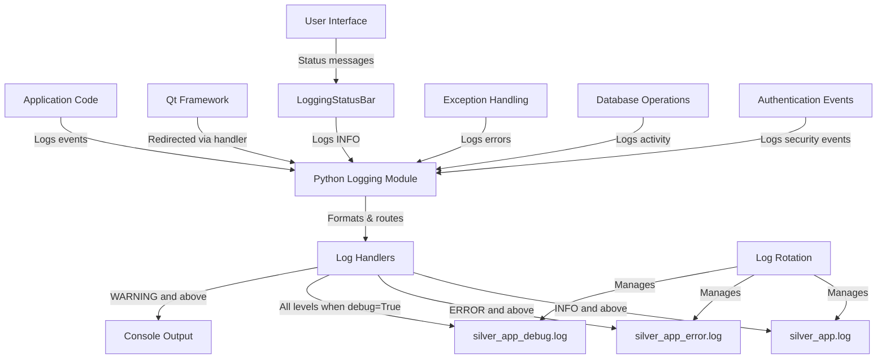

# Silver Estimation App - Logging Architecture

## 1. Overview and Goals

The proposed logging architecture aims to replace ad-hoc print() statements with a structured, configurable logging system that provides:

1. **Consistent error reporting** across all application components
2. **Configurable verbosity levels** for different deployment scenarios
3. **Secure handling of sensitive information**
4. **Proper exception handling** with detailed context
5. **Rotation-based log file management**
6. **Integration with the existing PyQt5 desktop application**

## 2. Logging Levels and Usage Guidelines

### 2.1 Log Level Definitions

The architecture will use Python's standard logging levels with the following guidelines:

| Level | When to Use | Examples |
|-------|-------------|----------|
| **CRITICAL** (50) | Application-breaking errors that prevent core functionality | Database encryption failure, Authentication system failure |
| **ERROR** (40) | Errors that affect functionality but don't crash the app | Failed database operations, UI rendering errors |
| **WARNING** (30) | Potential issues that don't immediately affect functionality | Slow queries, Unexpected data formats, Deprecated feature usage |
| **INFO** (20) | Normal operational events worth recording | User login, Estimate creation, Silver bar transfers |
| **DEBUG** (10) | Detailed information for troubleshooting | Function entry/exit, Variable values, SQL queries |

### 2.2 Usage Guidelines

#### CRITICAL
- Use sparingly for truly catastrophic errors
- Always include complete exception information
- Should trigger immediate notification in production

```python
try:
    # Critical operation
except Exception as e:
    logger.critical("Database encryption failed - application cannot continue", exc_info=True)
    # Show error to user and exit application
```

#### ERROR
- Use for exceptions that prevent a specific operation
- Include exception details and context
- Should be reviewed regularly in production

```python
try:
    # Important operation
except Exception as e:
    logger.error(f"Failed to save estimate {voucher_no}: {str(e)}", exc_info=True)
    # Show error to user but continue application
```

#### WARNING
- Use for unusual but handled conditions
- Include relevant context for investigation
- Should be monitored for patterns

```python
if query_time > 1.0:  # Slow query threshold
    logger.warning(f"Slow query detected ({query_time:.2f}s): {query[:100]}")
```

#### INFO
- Use for normal but significant operations
- Include business-relevant identifiers
- Should provide operational visibility

```python
logger.info(f"Estimate {voucher_no} created with {len(items)} items")
```

#### DEBUG
- Use for detailed troubleshooting information
- Can include technical details
- Disabled in production by default

```python
logger.debug(f"Processing item code: {code}, found in database: {item is not None}")
```

## 3. Log File Configuration

### 3.1 File Structure

The logging system will use a structured approach with multiple log files:

```
logs/
├── silver_app.log         # Main application log (INFO and above)
├── silver_app_debug.log   # Debug log (all messages when debug enabled)
├── silver_app_error.log   # Error log (ERROR and CRITICAL only)
└── archived/              # Directory for rotated logs
    ├── silver_app.log.1   # Rotated logs
    ├── silver_app.log.2
    └── ...
```

### 3.2 Rotation Policy

To prevent logs from growing indefinitely:

- **Size-based rotation**: 5MB per file
- **Count-based retention**: Keep 10 backup files
- **Compression**: Compress older logs (except the most recent)

### 3.3 Format

Log entries will follow a consistent format with essential context:

```
2025-04-29 18:15:23,456 [INFO] [main:125] [MainWindow.__init__] Application started with version 1.62
```

Format string: `%(asctime)s [%(levelname)s] [%(module)s:%(lineno)d] [%(funcName)s] %(message)s`

## 4. Logging Initialization Function

### 4.1 Logger Configuration Function

```python
import logging
import logging.handlers
import os
from datetime import datetime
from pathlib import Path

def setup_logging(app_name="silver_app", log_dir="logs", debug_mode=False):
    """
    Configure the logging system for the Silver Estimation App.
    
    Args:
        app_name (str): Base name for log files
        log_dir (str): Directory to store log files
        debug_mode (bool): Whether to enable debug logging
    
    Returns:
        logging.Logger: Configured root logger
    """
    # Create log directory if it doesn't exist
    log_path = Path(log_dir)
    archived_path = log_path / "archived"
    log_path.mkdir(exist_ok=True)
    archived_path.mkdir(exist_ok=True)
    
    # Configure root logger
    root_logger = logging.getLogger()
    root_logger.setLevel(logging.DEBUG if debug_mode else logging.INFO)
    
    # Clear any existing handlers
    for handler in root_logger.handlers[:]:
        root_logger.removeHandler(handler)
    
    # Common log format
    log_format = logging.Formatter(
        '%(asctime)s [%(levelname)s] [%(module)s:%(lineno)d] [%(funcName)s] %(message)s'
    )
    
    # Main log file (INFO and above)
    main_handler = logging.handlers.RotatingFileHandler(
        log_path / f"{app_name}.log",
        maxBytes=5*1024*1024,  # 5MB
        backupCount=10,
        encoding='utf-8'
    )
    main_handler.setLevel(logging.INFO)
    main_handler.setFormatter(log_format)
    root_logger.addHandler(main_handler)
    
    # Error log file (ERROR and CRITICAL only)
    error_handler = logging.handlers.RotatingFileHandler(
        log_path / f"{app_name}_error.log",
        maxBytes=5*1024*1024,  # 5MB
        backupCount=10,
        encoding='utf-8'
    )
    error_handler.setLevel(logging.ERROR)
    error_handler.setFormatter(log_format)
    root_logger.addHandler(error_handler)
    
    # Debug log file (all levels, only when debug_mode is True)
    if debug_mode:
        debug_handler = logging.handlers.RotatingFileHandler(
            log_path / f"{app_name}_debug.log",
            maxBytes=10*1024*1024,  # 10MB
            backupCount=5,
            encoding='utf-8'
        )
        debug_handler.setLevel(logging.DEBUG)
        debug_handler.setFormatter(log_format)
        root_logger.addHandler(debug_handler)
    
    # Console handler for development
    console_handler = logging.StreamHandler()
    console_handler.setLevel(logging.DEBUG if debug_mode else logging.WARNING)
    console_handler.setFormatter(log_format)
    root_logger.addHandler(console_handler)
    
    # Log startup information
    root_logger.info(f"Logging initialized at {datetime.now().isoformat()}")
    if debug_mode:
        root_logger.info("Debug logging enabled")
    
    return root_logger
```

### 4.2 Integration with Application Startup

Add to `main.py`:

```python
if __name__ == "__main__":
    # Initialize logging before anything else
    debug_mode = os.environ.get('APP_ENV', '').lower() == 'development'
    logger = setup_logging(debug_mode=debug_mode)
    
    try:
        # Create the application object
        app = QApplication(sys.argv)
        
        # Log application startup
        logger.info(f"Silver Estimation App v1.62 starting")
        
        # Continue with existing startup code...
        
    except Exception as e:
        logger.critical("Application failed to start", exc_info=True)
        QMessageBox.critical(None, "Fatal Error", 
                            f"The application failed to start: {str(e)}\n\n"
                            f"Please check the logs for details.")
        sys.exit(1)
```

## 5. Exception Handling Best Practices

### 5.1 Replace Generic Exception Blocks

**Current pattern (problematic):**
```python
try:
    # Some operation
except Exception as e:
    print(f"Error: {e}")
    QMessageBox.critical(self, "Error", f"An error occurred: {e}")
```

**Improved pattern:**
```python
try:
    # Some operation
except ValueError as e:
    logger.error(f"Invalid value: {str(e)}", exc_info=True)
    QMessageBox.warning(self, "Input Error", f"Please check your input: {str(e)}")
except sqlite3.Error as e:
    logger.error(f"Database error: {str(e)}", exc_info=True)
    QMessageBox.critical(self, "Database Error", 
                        "A database error occurred. Your data is safe, but the operation couldn't be completed.")
except Exception as e:
    logger.error("Unexpected error", exc_info=True)
    QMessageBox.critical(self, "Error", 
                        "An unexpected error occurred. Please check the logs for details.")
```

### 5.2 Context Manager for Database Operations

```python
class DatabaseOperation:
    """Context manager for database operations with proper logging and error handling."""
    
    def __init__(self, db_manager, operation_name, logger=None):
        self.db_manager = db_manager
        self.operation_name = operation_name
        self.logger = logger or logging.getLogger()
        self.success = False
    
    def __enter__(self):
        self.logger.debug(f"Starting database operation: {self.operation_name}")
        return self
    
    def __exit__(self, exc_type, exc_val, exc_tb):
        if exc_type is None:
            self.logger.debug(f"Completed database operation: {self.operation_name}")
            self.success = True
            return True
        
        if issubclass(exc_type, sqlite3.Error):
            self.logger.error(f"Database error during {self.operation_name}: {str(exc_val)}", exc_info=True)
        elif issubclass(exc_type, ValueError):
            self.logger.warning(f"Value error during {self.operation_name}: {str(exc_val)}", exc_info=True)
        else:
            self.logger.error(f"Unexpected error during {self.operation_name}: {str(exc_val)}", exc_info=True)
        
        # Don't suppress the exception
        return False
```

Usage:
```python
with DatabaseOperation(self.db_manager, f"save_estimate_{voucher_no}", logger) as op:
    # Database operations here
    self.db_manager.save_estimate_with_returns(...)
    
if op.success:
    logger.info(f"Estimate {voucher_no} saved successfully")
    self._status(f"Estimate {voucher_no} saved successfully", 3000)
```

### 5.3 Sensitive Information Handling

```python
def sanitize_for_logging(data, sensitive_keys=None):
    """
    Sanitize potentially sensitive data for logging.
    
    Args:
        data: Dictionary containing data to sanitize
        sensitive_keys: List of keys to mask
        
    Returns:
        Dict: Sanitized copy of the data
    """
    if sensitive_keys is None:
        sensitive_keys = ['password', 'key', 'salt', 'hash', 'token', 'secret']
    
    if not isinstance(data, dict):
        return data
    
    result = {}
    for key, value in data.items():
        if any(s_key in key.lower() for s_key in sensitive_keys):
            result[key] = '********'
        elif isinstance(value, dict):
            result[key] = sanitize_for_logging(value, sensitive_keys)
        else:
            result[key] = value
    
    return result
```

Usage:
```python
user_data = {'username': 'admin', 'password': 'secret123', 'settings': {'theme': 'dark'}}
logger.info(f"User data: {sanitize_for_logging(user_data)}")
# Logs: User data: {'username': 'admin', 'password': '********', 'settings': {'theme': 'dark'}}
```

## 6. Integration with PyQt5

### 6.1 Qt Message Handler

```python
def qt_message_handler(mode, context, message):
    """
    Handle Qt debug/warning/critical messages and redirect to Python logging.
    
    Args:
        mode: QtMsgType enum value
        context: QMessageLogContext object
        message: The message text
    """
    logger = logging.getLogger('qt')
    
    if mode == QtCore.QtMsgType.QtDebugMsg:
        logger.debug(message)
    elif mode == QtCore.QtMsgType.QtInfoMsg:
        logger.info(message)
    elif mode == QtCore.QtMsgType.QtWarningMsg:
        logger.warning(message)
    elif mode == QtCore.QtMsgType.QtCriticalMsg:
        logger.error(message)
    elif mode == QtCore.QtMsgType.QtFatalMsg:
        logger.critical(message)
```

Add to main.py:
```python
# Set up Qt message redirection
QtCore.qInstallMessageHandler(qt_message_handler)
```

### 6.2 Status Bar Integration

```python
class LoggingStatusBar(QStatusBar):
    """Status bar that logs messages in addition to displaying them."""
    
    def __init__(self, parent=None, logger=None):
        super().__init__(parent)
        self.logger = logger or logging.getLogger()
    
    def showMessage(self, message, timeout=0):
        """Show message in status bar and log at INFO level."""
        self.logger.info(f"Status: {message}")
        super().showMessage(message, timeout)
```

Usage:
```python
self.statusBar = LoggingStatusBar(self, logging.getLogger())
self.setStatusBar(self.statusBar)
```

## 7. Implementation Strategy

### 7.1 Phased Approach

1. **Phase 1: Core Logging Infrastructure**
   - Implement setup_logging function
   - Add to application startup
   - Create LoggingStatusBar

2. **Phase 2: Critical Path Logging**
   - Add logging to authentication flow
   - Add logging to database operations
   - Add logging to estimate saving/loading

3. **Phase 3: Comprehensive Coverage**
   - Replace all print() statements with appropriate logging
   - Implement context managers for operations
   - Add detailed debug logging

### 7.2 Example Implementation for Key Components

#### Database Manager

```python
class DatabaseManager:
    def __init__(self, db_path, password):
        self.logger = logging.getLogger(__name__)
        self.logger.info(f"Initializing DatabaseManager for {db_path}")
        
        try:
            # Existing initialization code...
            self.logger.debug("Database manager initialized successfully")
        except Exception as e:
            self.logger.critical(f"Failed to initialize database manager", exc_info=True)
            raise
    
    def _encrypt_db(self):
        self.logger.debug(f"Encrypting database to {self.encrypted_db_path}")
        try:
            # Existing encryption code...
            self.logger.info("Database encrypted successfully")
            return True
        except Exception as e:
            self.logger.error("Database encryption failed", exc_info=True)
            return False
```

#### Authentication Flow

```python
def run_authentication():
    logger = logging.getLogger(__name__)
    logger.info("Starting authentication process")
    
    settings = QSettings("YourCompany", "SilverEstimateApp")
    password_hash = settings.value("security/password_hash")
    backup_hash = settings.value("security/backup_hash")
    
    if password_hash and backup_hash:
        logger.debug("Found existing password hashes, showing login dialog")
        # Existing login code...
    else:
        logger.info("No password hashes found, starting first-time setup")
        # Existing setup code...
```

## 8. Security Considerations

### 8.1 Sensitive Data Protection

- **Never log passwords** (even hashed)
- **Never log encryption keys or salts**
- **Never log complete database content**
- Use the sanitize_for_logging function for user data

### 8.2 Log File Protection

- Set appropriate file permissions on log directory
- Consider encrypting sensitive log files
- Implement log rotation to limit exposure

### 8.3 Error Message Security

- Use generic error messages in user-facing dialogs
- Keep detailed error information in logs only
- Don't expose internal paths or implementation details

## 9. Logging Architecture Diagram



## 10. Configuration Management

### 10.1 Settings Dialog Integration

Add logging configuration to the settings dialog:

```python
# In SettingsDialog class
def setup_logging_tab(self):
    logging_tab = QWidget()
    layout = QVBoxLayout(logging_tab)
    
    # Debug mode checkbox
    self.debug_mode_checkbox = QCheckBox("Enable Debug Logging")
    self.debug_mode_checkbox.setChecked(QSettings().value("logging/debug_mode", False, type=bool))
    
    # Log retention settings
    retention_layout = QFormLayout()
    self.log_retention_spin = QSpinBox()
    self.log_retention_spin.setRange(1, 100)
    self.log_retention_spin.setValue(QSettings().value("logging/retention_days", 30, type=int))
    retention_layout.addRow("Log Retention (days):", self.log_retention_spin)
    
    # Add to layout
    layout.addWidget(self.debug_mode_checkbox)
    layout.addLayout(retention_layout)
    layout.addStretch()
    
    return logging_tab

def save_settings(self):
    # Existing save code...
    
    # Save logging settings
    settings = QSettings()
    settings.setValue("logging/debug_mode", self.debug_mode_checkbox.isChecked())
    settings.setValue("logging/retention_days", self.log_retention_spin.value())
    
    # Apply logging settings
    debug_mode = self.debug_mode_checkbox.isChecked()
    logging.getLogger().setLevel(logging.DEBUG if debug_mode else logging.INFO)
```

### 10.2 Environment Variable Support

```python
def get_log_config():
    """Get logging configuration from environment variables or settings."""
    settings = QSettings("YourCompany", "SilverEstimateApp")
    
    # Environment variables take precedence
    debug_mode = os.environ.get('SILVER_APP_DEBUG', '').lower() in ('true', '1', 'yes')
    if 'SILVER_APP_DEBUG' not in os.environ:
        debug_mode = settings.value("logging/debug_mode", False, type=bool)
    
    log_dir = os.environ.get('SILVER_APP_LOG_DIR', 'logs')
    
    return {
        'debug_mode': debug_mode,
        'log_dir': log_dir
    }
```

## Conclusion

This logging architecture provides a comprehensive solution for the Silver Estimation App that:

1. **Replaces ad-hoc print() statements** with structured, level-appropriate logging
2. **Integrates with PyQt5** for consistent error handling and status reporting
3. **Protects sensitive information** through proper sanitization
4. **Manages log files** with appropriate rotation and retention policies
5. **Provides configurable verbosity** for different deployment scenarios

By implementing this architecture, the application will gain:
- Improved troubleshooting capabilities
- Better security through proper handling of sensitive information
- More reliable error handling
- Enhanced maintainability through consistent logging practices