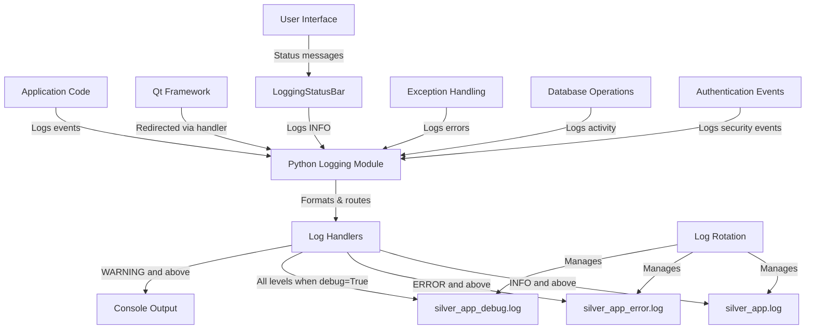

# Silver Estimation App - Logging Guide

## Table of Contents
- [1. Logging System Architecture](#1-logging-system-architecture)
- [2. Configuration Options](#2-configuration-options)
- [3. Log Levels and Usage](#3-log-levels-and-usage)
- [4. Using the Logging System](#4-using-the-logging-system)
- [5. Error Handling Best Practices](#5-error-handling-best-practices)
- [6. Log File Management](#6-log-file-management)
- [7. Analyzing Logs for Troubleshooting](#7-analyzing-logs-for-troubleshooting)
- [8. Advanced Topics](#8-advanced-topics)

## 1. Logging System Architecture

### Overview

The Silver Estimation App uses a structured, configurable logging system built on Python's standard `logging` module, with custom enhancements for PyQt5 integration. This system replaces ad-hoc `print()` statements with a consistent, level-based logging approach that provides:

- Consistent error reporting across all application components
- Configurable verbosity levels for different deployment scenarios
- Secure handling of sensitive information
- Proper exception handling with detailed context
- Rotation-based log file management
- Integration with the PyQt5 desktop application

### Architecture Diagram



### File Structure

The logging system organizes log files in a structured manner:

```
logs/
├── silver_app.log         # Main application log (INFO and above)
├── silver_app_debug.log   # Debug log (all messages when debug enabled)
├── silver_app_error.log   # Error log (ERROR and CRITICAL only)
└── archived/              # Directory for rotated logs
    ├── silver_app.log.1   # Rotated logs
    ├── silver_app.log.2
    └── ...
```

### Core Components

1. **Logger Module (`logger.py`)**: Contains the core logging functionality
   - `setup_logging()`: Configures the logging system
   - `qt_message_handler()`: Redirects Qt messages to Python logging
   - `LoggingStatusBar`: Integrates status bar messages with logging
   - `DatabaseOperation`: Context manager for database operations with logging
   - `sanitize_for_logging()`: Protects sensitive data in logs

2. **PyQt5 Integration**:
   - Qt message redirection to Python logging
   - Status bar message logging
   - Settings dialog for log configuration

3. **Log Handlers**:
   - File handlers with rotation for different log levels
   - Console handler for development environments

## 2. Configuration Options

### Default Configuration

The logging system is configured with sensible defaults:

- Log files stored in the `logs/` directory
- INFO level and above logged to main log file
- ERROR level and above logged to error log file
- DEBUG level (when enabled) logged to debug log file
- WARNING level and above logged to console
- 5MB size-based rotation with 10 backup files

### Environment Variables

You can configure logging behavior using environment variables:

| Variable | Description | Default |
|----------|-------------|---------|
| `SILVER_APP_DEBUG` | Enable debug logging | `false` |
| `SILVER_APP_LOG_DIR` | Directory for log files | `logs` |

Example:
```bash
# Windows
set SILVER_APP_DEBUG=true
python main.py

# Linux/macOS
SILVER_APP_DEBUG=true python main.py
```

### Settings Dialog

Logging configuration can be managed through the application's Settings dialog:

1. Access via: **Tools → Settings → Logging**
2. The Logging tab provides the following options:

#### Debug Settings
- **Enable Debug Mode**: Toggles detailed debug logging (may affect performance)
- When enabled, detailed diagnostic information is captured in the debug log file

#### Log Levels
- **Enable Normal Logs (INFO)**: Toggle logging of day-to-day application events
- **Enable Critical Logs (ERROR and CRITICAL)**: Toggle logging of errors and critical issues
- **Enable Debug Logs**: Toggle logging of detailed debug information (only when Debug Mode is enabled)

#### Automatic Log Cleanup
- **Automatically Delete Old Logs**: Enable automatic deletion of log files older than the specified period
- **Keep logs for X days**: Configure the retention period (1-365 days)
- Automatic cleanup runs at midnight each day
- **Clean Up Logs Now**: Manually trigger log cleanup based on current settings


### Programmatic Configuration

You can configure logging programmatically by calling `setup_logging()` with parameters:

```python
from logger import setup_logging

# Configure with custom settings
logger = setup_logging(
    app_name="silver_app",  # Base name for log files
    log_dir="custom_logs",  # Directory to store logs
    debug_mode=True         # Enable debug logging
)
```

### Log Format

Log entries follow a consistent format with essential context:

```
2025-04-29 18:15:23,456 [INFO] [main:125] [MainWindow.__init__] Application started with version 1.62
```

Format string: `%(asctime)s [%(levelname)s] [%(module)s:%(lineno)d] [%(funcName)s] %(message)s`

## 3. Log Levels and Usage

The Silver Estimation App uses Python's standard logging levels with specific guidelines:

### Critical (50)

Use for application-breaking errors that prevent core functionality.

**When to use:**
- Database encryption failure
- Authentication system failure
- Application startup failure
- Critical security breaches

**Example:**
```python
try:
    # Critical operation
    initialize_encryption()
except Exception as e:
    logger.critical("Database encryption failed - application cannot continue", exc_info=True)
    # Show error to user and exit application
    sys.exit(1)
```

### Error (40)

Use for errors that affect functionality but don't crash the app.

**When to use:**
- Failed database operations
- UI rendering errors
- Network connection failures
- File I/O errors

**Example:**
```python
try:
    # Important operation
    self.db_manager.save_estimate(voucher_no, items)
except Exception as e:
    logger.error(f"Failed to save estimate {voucher_no}: {str(e)}", exc_info=True)
    # Show error to user but continue application
    QMessageBox.critical(self, "Error", "Failed to save estimate.")
```

### Warning (30)

Use for potential issues that don't immediately affect functionality.

**When to use:**
- Slow queries
- Unexpected data formats
- Deprecated feature usage
- Low disk space
- Configuration issues

**Example:**
```python
if query_time > 1.0:  # Slow query threshold
    logger.warning(f"Slow query detected ({query_time:.2f}s): {query[:100]}")
```

### Info (20)

Use for normal operational events worth recording.

**When to use:**
- User login/logout
- Estimate creation
- Silver bar transfers
- Application startup/shutdown
- Feature usage

**Example:**
```python
logger.info(f"Estimate {voucher_no} created with {len(items)} items")
```

### Debug (10)

Use for detailed information for troubleshooting.

**When to use:**
- Function entry/exit
- Variable values
- SQL queries
- UI event handling
- Detailed flow control

**Example:**
```python
logger.debug(f"Processing item code: {code}, found in database: {item is not None}")
```

## 4. Using the Logging System

### Basic Usage

To use the logging system in your code:

1. Import the logging module:
   ```python
   import logging
   ```

2. Get a logger for your module:
   ```python
   logger = logging.getLogger(__name__)
   ```

3. Log messages at appropriate levels:
   ```python
   logger.debug("Detailed information for troubleshooting")
   logger.info("Normal operational event")
   logger.warning("Potential issue detected")
   logger.error("Error that affects functionality", exc_info=True)
   logger.critical("Application-breaking error", exc_info=True)
   ```

### Module-Specific Loggers

Create module-specific loggers to categorize logs by component:

```python
# In database_manager.py
class DatabaseManager:
    def __init__(self):
        self.logger = logging.getLogger(__name__)
        self.logger.info("Initializing DatabaseManager")
```

### Logging in UI Components

Integrate logging with UI components:

```python
class EstimateEntryWidget(QWidget):
    def __init__(self, db_manager, parent=None):
        super().__init__(parent)
        self.logger = logging.getLogger(__name__)
        self.logger.info("Initializing EstimateEntryWidget")
        
    def save_estimate(self):
        try:
            # Save operation
            self.logger.info(f"Estimate {voucher_no} saved successfully")
            self.status_bar.showMessage("Estimate saved successfully", 3000)
        except Exception as e:
            self.logger.error(f"Failed to save estimate: {str(e)}", exc_info=True)
```

### Using LoggingStatusBar

The `LoggingStatusBar` class automatically logs status bar messages:

```python
from logger import LoggingStatusBar

# In your MainWindow class
self.statusBar = QStatusBar()
self.setStatusBar(self.statusBar)
self.logging_status = LoggingStatusBar(self.statusBar, self.logger)

# Now status messages are automatically logged
self.logging_status.show_message("Processing complete", 3000)
```

### Logging Database Operations

Use the `DatabaseOperation` context manager for database operations:

```python
from logger import DatabaseOperation

# Using the context manager
with DatabaseOperation(self.db_manager, f"save_estimate_{voucher_no}", logger) as op:
    # Database operations here
    self.db_manager.save_estimate_with_returns(...)
    
if op.success:
    logger.info(f"Estimate {voucher_no} saved successfully")
    self._status(f"Estimate {voucher_no} saved successfully", 3000)
```

### Handling Sensitive Information

Use the `sanitize_for_logging()` function to protect sensitive data:

```python
from logger import sanitize_for_logging

user_data = {'username': 'admin', 'password': 'secret123', 'settings': {'theme': 'dark'}}
logger.info(f"User data: {sanitize_for_logging(user_data)}")
# Logs: User data: {'username': 'admin', 'password': '********', 'settings': {'theme': 'dark'}}
```

## 5. Error Handling Best Practices

### Exception Handling Patterns

Replace generic exception blocks with specific exception handling:

**Avoid:**
```python
try:
    # Some operation
except Exception as e:
    print(f"Error: {e}")
    QMessageBox.critical(self, "Error", f"An error occurred: {e}")
```

**Preferred:**
```python
try:
    # Some operation
except ValueError as e:
    logger.error(f"Invalid value: {str(e)}", exc_info=True)
    QMessageBox.warning(self, "Input Error", f"Please check your input: {str(e)}")
except sqlite3.Error as e:
    logger.error(f"Database error: {str(e)}", exc_info=True)
    QMessageBox.critical(self, "Database Error", 
                        "A database error occurred. Your data is safe, but the operation couldn't be completed.")
except Exception as e:
    logger.error("Unexpected error", exc_info=True)
    QMessageBox.critical(self, "Error", 
                        "An unexpected error occurred. Please check the logs for details.")
```

### Using Context Managers

Create context managers for operations that require consistent logging and error handling:

```python
class DatabaseOperation:
    """Context manager for database operations with proper logging and error handling."""
    
    def __init__(self, db_manager, operation_name, logger=None):
        self.db_manager = db_manager
        self.operation_name = operation_name
        self.logger = logger or logging.getLogger()
        self.success = False
    
    def __enter__(self):
        self.logger.debug(f"Starting database operation: {self.operation_name}")
        return self
    
    def __exit__(self, exc_type, exc_val, exc_tb):
        if exc_type is None:
            self.logger.debug(f"Completed database operation: {self.operation_name}")
            self.success = True
            return True
        
        import sqlite3
        if issubclass(exc_type, sqlite3.Error):
            self.logger.error(f"Database error during {self.operation_name}: {str(exc_val)}", exc_info=True)
        elif issubclass(exc_type, ValueError):
            self.logger.warning(f"Value error during {self.operation_name}: {str(exc_val)}", exc_info=True)
        else:
            self.logger.error(f"Unexpected error during {self.operation_name}: {str(exc_val)}", exc_info=True)
        
        # Don't suppress the exception
        return False
```

### Capturing Stack Traces

Always include stack traces for errors to aid debugging:

```python
try:
    # Operation that might fail
    process_data()
except Exception as e:
    # Pass exc_info=True to include stack trace
    logger.error(f"Failed to process data: {str(e)}", exc_info=True)
```

### User-Facing Error Messages vs. Log Details

Follow these guidelines for error reporting:

1. **User-facing messages**: 
   - Keep simple and actionable
   - Avoid technical details
   - Focus on what the user can do

2. **Log messages**:
   - Include detailed technical information
   - Add context (IDs, parameters, state)
   - Include stack traces for errors

Example:
```python
try:
    result = complex_calculation(value1, value2)
except ZeroDivisionError:
    # Detailed log for developers
    logger.error(f"Division by zero in calculation with values: {value1}, {value2}", exc_info=True)
    
    # Simple message for users
    QMessageBox.warning(self, "Calculation Error", 
                       "Cannot perform calculation with the provided values. Please check your inputs.")
```

## 6. Log File Management

### Log File Locations

By default, log files are stored in the `logs/` directory relative to the application root:

- `logs/silver_app.log`: Main application log (INFO and above) - if INFO logs are enabled
- `logs/silver_app_error.log`: Error log (ERROR and CRITICAL only) - if ERROR logs are enabled
- `logs/silver_app_debug.log`: Debug log (all messages when debug enabled) - if DEBUG logs are enabled
- `logs/archived/`: Directory for rotated logs

You can customize the log directory using the `SILVER_APP_LOG_DIR` environment variable or through the settings dialog.

### Rotation Policies

The logging system uses size-based rotation to prevent logs from growing indefinitely:

- **Main log file**: 5MB per file, 10 backup files
- **Error log file**: 5MB per file, 10 backup files
- **Debug log file**: 10MB per file, 5 backup files

When a log file reaches its size limit, it's renamed with a numeric suffix (e.g., `silver_app.log.1`), and a new log file is created.

### Automatic Log Cleanup

The application includes an automatic log cleanup feature that helps manage disk space:

1. **Configuration**:
   - Enable/disable in Settings → Logging → Automatic Log Cleanup
   - Set retention period (1-365 days)
   - Logs older than the specified period will be automatically deleted

2. **Cleanup Schedule**:
   - Automatic cleanup runs at midnight each day
   - The scheduler calculates the time until midnight and sets up a timer
   - Subsequent cleanups occur every 24 hours

3. **Manual Cleanup**:
   - Click "Clean Up Logs Now" in the Settings dialog to manually trigger cleanup
   - Uses the same retention period as automatic cleanup
   - Provides immediate feedback on how many files were removed

4. **Implementation**:
   ```python
   # Example of how automatic cleanup works
   def cleanup_old_logs(log_dir="logs", max_age_days=30):
       """Remove log files older than max_age_days."""
       cutoff = datetime.now() - timedelta(days=max_age_days)
       removed_count = 0
       
       # Process log files in main and archived directories
       for file_path in Path(log_dir).glob("**/*.log*"):
           if file_path.is_file():
               file_time = datetime.fromtimestamp(file_path.stat().st_mtime)
               if file_time < cutoff:
                   file_path.unlink()  # Delete the file
                   removed_count += 1
                   
       return removed_count
   ```

### Log Level Management

The application now allows you to selectively enable or disable specific log levels:

1. **Configurable Log Levels**:
   - **Normal Logs (INFO)**: Day-to-day application events
   - **Critical Logs (ERROR/CRITICAL)**: Error conditions and critical issues
   - **Debug Logs**: Detailed diagnostic information (only when Debug Mode is enabled)

2. **Use Cases for Disabling Log Levels**:
   - Disable INFO logs to reduce disk usage in stable production environments
   - Disable DEBUG logs to improve performance even when debug mode is enabled
   - Keep ERROR logs enabled for troubleshooting even in production

3. **Configuration Methods**:
   - Through Settings dialog: Tools → Settings → Logging → Log Levels
   - Programmatically:
     ```python
     # Example of programmatically configuring log levels
     from logger import reconfigure_logging
     
     # Update settings
     settings = QSettings("YourCompany", "SilverEstimateApp")
     settings.setValue("logging/enable_info", False)  # Disable INFO logs
     settings.setValue("logging/enable_critical", True)  # Keep ERROR logs
     settings.setValue("logging/enable_debug", False)  # Disable DEBUG logs
     
     # Apply changes
     reconfigure_logging()
     ```

## 7. Analyzing Logs for Troubleshooting

### Common Log Patterns

Understanding common log patterns can help quickly identify issues:

#### Application Startup

```
2025-04-29 18:15:23,456 [INFO] [main:582] [<module>] Silver Estimation App v1.62 starting
2025-04-29 18:15:23,789 [INFO] [logger:82] [setup_logging] Logging initialized at 2025-04-29T18:15:23.789
2025-04-29 18:15:24,123 [INFO] [main:594] [<module>] Creating QApplication instance
```

#### Authentication Flow

```
2025-04-29 18:15:24,456 [INFO] [main:460] [run_authentication] Starting authentication process
2025-04-29 18:15:24,789 [DEBUG] [main:468] [run_authentication] Found existing password hashes, showing login dialog
2025-04-29 18:15:30,123 [INFO] [main:483] [run_authentication] Authentication successful
```

#### Database Operations

```
2025-04-29 18:15:35,456 [INFO] [database_manager:432] [__init__] Initializing DatabaseManager for database/estimation.db
2025-04-29 18:15:35,789 [DEBUG] [database_manager:436] [__init__] Database manager initialized successfully
2025-04-29 18:15:36,123 [DEBUG] [logger:132] [__enter__] Starting database operation: save_estimate_1234
2025-04-29 18:15:36,456 [DEBUG] [logger:137] [__exit__] Completed database operation: save_estimate_1234
```

#### Error Patterns

```
2025-04-29 18:15:40,123 [ERROR] [database_manager:448] [_encrypt_db] Database encryption failed
Traceback (most recent call last):
  File "database_manager.py", line 445, in _encrypt_db
    with open(self.encrypted_db_path, 'wb') as f:
PermissionError: [Errno 13] Permission denied: 'database/estimation.db'
```

### Identifying Issues from Logs

When troubleshooting, look for these indicators in logs:

1. **Unexpected ERROR or CRITICAL entries**: 
   - Check the timestamp to correlate with user-reported issues
   - Examine the stack trace for the root cause
   - Look for patterns in preceding log entries

2. **Warning patterns**:
   - Multiple "Slow query detected" warnings may indicate database optimization issues
   - Repeated "Value error" warnings may suggest UI validation problems

3. **Authentication issues**:
   - Look for "Authentication failed" entries
   - Check for missing or corrupted settings entries

4. **Database problems**:
   - Search for "Database error" entries
   - Look for SQLite error codes and messages
   - Check for transaction deadlocks or constraint violations

### Correlating Events Across Log Files

To get a complete picture of an issue:

1. **Use timestamps to correlate events**:
   - Check `silver_app.log` for the general flow
   - Look in `silver_app_error.log` for detailed error information
   - Examine `silver_app_debug.log` for detailed context around the error

2. **Follow user sessions**:
   - Track from login through to the error
   - Look for unusual patterns or missing steps

3. **Use grep or log analysis tools**:
   ```bash
   # Find all errors for a specific voucher number
   grep "voucher_no=1234" logs/silver_app*.log
   
   # Find all database errors
   grep -A 10 "Database error" logs/silver_app_error.log
   ```

### Using Debug Logs Effectively

When more detailed information is needed:

1. **Enable debug mode and debug logs**:
   - In Settings dialog: Tools → Settings → Logging → Debug Settings
   - Or set `SILVER_APP_DEBUG=true` environment variable
   - Ensure "Enable Debug Logs" is checked

2. **Focus on specific modules**:
   ```python
   # Temporarily increase logging for specific module
   logging.getLogger('database_manager').setLevel(logging.DEBUG)
   ```

3. **Add temporary debug logging**:
   ```python
   logger.debug(f"Variable state: x={x}, y={y}, mode={self.mode}")
   ```

4. **Look for sequence patterns**:
   - Function entry/exit pairs
   - Database operation start/complete pairs
   - UI event sequences

5. **Performance Considerations**:
   - Debug logging can impact performance, especially in loops or high-frequency operations
   - Consider disabling debug logs but keeping debug mode enabled if you need detailed logs for only certain components
   - Use the lazy evaluation pattern for expensive debug logging:
     ```python
     if logger.isEnabledFor(logging.DEBUG):
         logger.debug(f"Complex calculation result: {expensive_function()}")
     ```

## 8. Advanced Topics

### Custom Log Handlers

You can extend the logging system with custom handlers:

```python
class EmailErrorHandler(logging.Handler):
    """Handler that sends emails for critical errors."""
    
    def __init__(self, email_address):
        super().__init__(level=logging.CRITICAL)
        self.email_address = email_address
        
    def emit(self, record):
        # Format the log record
        message = self.format(record)
        
        # Send email (implementation depends on your email system)
        send_email(
            to=self.email_address,
            subject=f"CRITICAL ERROR: {record.getMessage()}",
            body=message
        )

# Add to logging system
email_handler = EmailErrorHandler("admin@example.com")
email_handler.setFormatter(log_format)
root_logger.addHandler(email_handler)
```

### Log Filtering

Create filters to control which log records are processed:

```python
class SensitiveDataFilter(logging.Filter):
    """Filter that removes sensitive data patterns from log messages."""
    
    def __init__(self, patterns=None):
        super().__init__()
        self.patterns = patterns or [
            r'password\s*=\s*[\'"][^\'"]*[\'"]',
            r'token\s*=\s*[\'"][^\'"]*[\'"]'
        ]
        self.compiled = [re.compile(p, re.IGNORECASE) for p in self.patterns]
        
    def filter(self, record):
        # Replace sensitive data in the message
        for pattern in self.compiled:
            record.msg = pattern.sub(r'\1=********', record.msg)
        return True

# Add to handlers
sensitive_filter = SensitiveDataFilter()
for handler in root_logger.handlers:
    handler.addFilter(sensitive_filter)
```

### Performance Considerations

Optimize logging performance with these techniques:

1. **Selective Log Level Enabling**:
   - Disable DEBUG logs in production environments
   - Consider disabling INFO logs in high-throughput scenarios
   - Always keep ERROR logs enabled for critical issue detection

2. **Lazy Evaluation**:
   ```python
   # Avoid expensive string formatting if the log won't be emitted
   if logger.isEnabledFor(logging.DEBUG):
       logger.debug(f"Complex calculation result: {expensive_function()}")
   ```

3. **Batch Processing**:
   ```python
   # For high-volume logging, consider batching
   log_buffer = []
   
   def flush_logs():
       for level, msg in log_buffer:
           logger.log(level, msg)
       log_buffer.clear()
   ```

4. **Sampling**:
   ```python
   # Log only a sample of high-volume events
   import random
   
   def sample_log(level, message, sample_rate=0.01):
       if random.random() < sample_rate:
           logger.log(level, f"SAMPLED (1:{int(1/sample_rate)}): {message}")
   ```

5. **Log Cleanup Impact**:
   - Automatic cleanup helps maintain application performance by preventing disk space issues
   - Set appropriate retention periods based on your storage capacity and troubleshooting needs
   - For most deployments, 7-30 days retention is recommended

### Security Implications

Consider these security aspects when logging:

1. **Log file permissions**:
   ```python
   import os
   
   def secure_log_permissions():
       # Set appropriate permissions on log files
       os.chmod('logs/silver_app.log', 0o640)  # Owner: rw, Group: r, Others: none
       os.chmod('logs/silver_app_error.log', 0o640)
   ```

2. **Sensitive data handling**:
   - Never log passwords, even hashed ones
   - Never log encryption keys or salts
   - Use the `sanitize_for_logging()` function for user data
   - Be careful with stack traces that might contain sensitive data

3. **Log injection prevention**:
   ```python
   def safe_log(message):
       # Remove potential log forging characters
       safe_message = message.replace('\n', ' ').replace('\r', ' ')
       logger.info(safe_message)
   ```

4. **Audit logging for security events**:
   ```python
   def log_security_event(event_type, user, details):
       """Log security-relevant events separately."""
       security_logger = logging.getLogger('security')
       security_logger.info(f"SECURITY: {event_type} | User: {user} | {details}")
   
   # Usage
   log_security_event("LOGIN_ATTEMPT", "admin", "Failed: incorrect password")