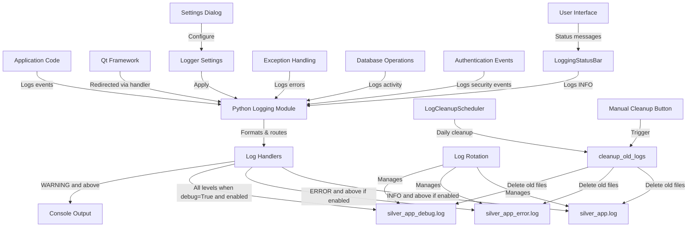

# Implementation Plan: Enhanced Logging System for Silver Estimation App

## Overview

This implementation plan outlines the changes needed to add the following features to the Silver Estimation App's logging system:

1. Add settings for the logger in the settings UI
2. Allow logs to be deleted automatically daily
3. Allow disabling of critical, debug, and normal logs individually

## 1. Current System Analysis

The current logging system is well-structured with:

- A modular design using Python's standard logging module
- Three log files with different severity levels:
  - `silver_app.log` (INFO and above)
  - `silver_app_error.log` (ERROR and CRITICAL)
  - `silver_app_debug.log` (all levels when debug mode is enabled)
- Size-based log rotation using RotatingFileHandler
- Configuration through environment variables and QSettings
- Utility classes like LoggingStatusBar and DatabaseOperation

## 2. Changes to logger.py

### 2.1 Add Configuration Options for Log Level Toggling

```python
def setup_logging(app_name="silver_app", log_dir="logs", debug_mode=False, 
                  enable_info=True, enable_error=True, enable_debug=True):
    """
    Configure the logging system for the Silver Estimation App.
    
    Args:
        app_name (str): Base name for log files
        log_dir (str): Directory to store log files
        debug_mode (bool): Whether to enable debug logging
        enable_info (bool): Whether to enable INFO level logs
        enable_error (bool): Whether to enable ERROR and CRITICAL level logs
        enable_debug (bool): Whether to enable DEBUG level logs (only when debug_mode is True)
    
    Returns:
        logging.Logger: Configured root logger
    """
    # Create log directory if it doesn't exist
    log_path = Path(log_dir)
    archived_path = log_path / "archived"
    log_path.mkdir(exist_ok=True)
    archived_path.mkdir(exist_ok=True)
    
    # Configure root logger
    root_logger = logging.getLogger()
    root_logger.setLevel(logging.DEBUG if debug_mode else logging.INFO)
    
    # Clear any existing handlers
    for handler in root_logger.handlers[:]:
        root_logger.removeHandler(handler)
    
    # Common log format
    log_format = logging.Formatter(
        '%(asctime)s [%(levelname)s] [%(module)s:%(lineno)d] [%(funcName)s] %(message)s'
    )
    
    # Main log file (INFO and above) - only if enabled
    if enable_info:
        main_handler = logging.handlers.RotatingFileHandler(
            log_path / f"{app_name}.log",
            maxBytes=5*1024*1024,  # 5MB
            backupCount=10,
            encoding='utf-8'
        )
        main_handler.setLevel(logging.INFO)
        main_handler.setFormatter(log_format)
        root_logger.addHandler(main_handler)
    
    # Error log file (ERROR and CRITICAL only) - only if enabled
    if enable_error:
        error_handler = logging.handlers.RotatingFileHandler(
            log_path / f"{app_name}_error.log",
            maxBytes=5*1024*1024,  # 5MB
            backupCount=10,
            encoding='utf-8'
        )
        error_handler.setLevel(logging.ERROR)
        error_handler.setFormatter(log_format)
        root_logger.addHandler(error_handler)
    
    # Debug log file (all levels, only when debug_mode is True and enabled)
    if debug_mode and enable_debug:
        debug_handler = logging.handlers.RotatingFileHandler(
            log_path / f"{app_name}_debug.log",
            maxBytes=10*1024*1024,  # 10MB
            backupCount=5,
            encoding='utf-8'
        )
        debug_handler.setLevel(logging.DEBUG)
        debug_handler.setFormatter(log_format)
        root_logger.addHandler(debug_handler)
    
    # Console handler for development
    console_handler = logging.StreamHandler()
    console_handler.setLevel(logging.DEBUG if debug_mode else logging.WARNING)
    console_handler.setFormatter(log_format)
    root_logger.addHandler(console_handler)
    
    # Log startup information
    root_logger.info(f"Logging initialized at {datetime.now().isoformat()}")
    if debug_mode:
        root_logger.info("Debug logging enabled")
    
    return root_logger
```

### 2.2 Add Daily Log Cleanup Function

```python
def cleanup_old_logs(log_dir="logs", max_age_days=1):
    """
    Remove log files older than max_age_days.
    
    Args:
        log_dir (str): Directory containing log files
        max_age_days (int): Maximum age of log files in days
    
    Returns:
        int: Number of files removed
    """
    log_path = Path(log_dir)
    if not log_path.exists():
        return 0
        
    cutoff = datetime.now() - timedelta(days=max_age_days)
    removed_count = 0
    
    # Process all log files in the main directory
    for file_path in log_path.glob("*.log*"):
        if file_path.is_file():
            file_time = datetime.fromtimestamp(file_path.stat().st_mtime)
            if file_time < cutoff:
                try:
                    file_path.unlink()
                    removed_count += 1
                except Exception as e:
                    logging.getLogger().warning(f"Failed to remove old log file {file_path}: {e}")
    
    # Process all log files in the archived directory
    archived_path = log_path / "archived"
    if archived_path.exists():
        for file_path in archived_path.glob("*.log*"):
            if file_path.is_file():
                file_time = datetime.fromtimestamp(file_path.stat().st_mtime)
                if file_time < cutoff:
                    try:
                        file_path.unlink()
                        removed_count += 1
                    except Exception as e:
                        logging.getLogger().warning(f"Failed to remove old archived log file {file_path}: {e}")
    
    return removed_count
```

### 2.3 Enhance get_log_config Function

```python
def get_log_config():
    """Get logging configuration from environment variables or settings."""
    settings = QSettings("YourCompany", "SilverEstimateApp")
    
    # Environment variables take precedence
    debug_mode = os.environ.get('SILVER_APP_DEBUG', '').lower() in ('true', '1', 'yes')
    if 'SILVER_APP_DEBUG' not in os.environ:
        debug_mode = settings.value("logging/debug_mode", False, type=bool)
    
    log_dir = os.environ.get('SILVER_APP_LOG_DIR', 'logs')
    
    # Get log level enable/disable settings
    enable_info = settings.value("logging/enable_info", True, type=bool)
    enable_error = settings.value("logging/enable_critical", True, type=bool)
    enable_debug = settings.value("logging/enable_debug", True, type=bool)
    
    # Get auto-cleanup settings
    auto_cleanup = settings.value("logging/auto_cleanup", False, type=bool)
    cleanup_days = settings.value("logging/cleanup_days", 1, type=int)
    
    return {
        'debug_mode': debug_mode,
        'log_dir': log_dir,
        'enable_info': enable_info,
        'enable_error': enable_error,
        'enable_debug': enable_debug,
        'auto_cleanup': auto_cleanup,
        'cleanup_days': cleanup_days
    }
```

### 2.4 Add Daily Log Cleanup Scheduler

```python
class LogCleanupScheduler:
    """Scheduler for automatic log cleanup."""
    
    def __init__(self, log_dir="logs", cleanup_days=1):
        """
        Initialize the log cleanup scheduler.
        
        Args:
            log_dir (str): Directory containing log files
            cleanup_days (int): Maximum age of log files in days
        """
        self.log_dir = log_dir
        self.cleanup_days = cleanup_days
        self.timer = None
        self.logger = logging.getLogger(__name__)
    
    def start(self):
        """Start the scheduled cleanup."""
        if self.timer is not None:
            self.stop()
            
        # Calculate time until midnight
        now = datetime.now()
        midnight = (now + timedelta(days=1)).replace(
            hour=0, minute=0, second=0, microsecond=0
        )
        seconds_until_midnight = (midnight - now).total_seconds()
        
        # Create a QTimer that fires at midnight
        self.timer = QtCore.QTimer()
        self.timer.timeout.connect(self._run_cleanup)
        self.timer.setSingleShot(False)
        self.timer.start(24 * 60 * 60 * 1000)  # 24 hours in milliseconds
        
        # Also run an initial cleanup after a short delay
        QtCore.QTimer.singleShot(int(seconds_until_midnight * 1000), self._run_cleanup)
        
        self.logger.info(f"Log cleanup scheduler started. Next cleanup in {seconds_until_midnight/3600:.1f} hours")
    
    def stop(self):
        """Stop the scheduled cleanup."""
        if self.timer is not None:
            self.timer.stop()
            self.timer = None
            self.logger.info("Log cleanup scheduler stopped")
    
    def _run_cleanup(self):
        """Run the cleanup operation."""
        try:
            removed_count = cleanup_old_logs(self.log_dir, self.cleanup_days)
            self.logger.info(f"Automatic log cleanup completed. Removed {removed_count} old log files")
        except Exception as e:
            self.logger.error(f"Error during automatic log cleanup: {e}", exc_info=True)
```

### 2.5 Add Function to Reconfigure Logging

```python
def reconfigure_logging():
    """
    Reconfigure the logging system based on current settings.
    Call this when settings are changed.
    """
    config = get_log_config()
    
    # Re-initialize logging with new settings
    setup_logging(
        debug_mode=config['debug_mode'],
        log_dir=config['log_dir'],
        enable_info=config['enable_info'],
        enable_error=config['enable_error'],
        enable_debug=config['enable_debug']
    )
    
    # Configure cleanup scheduler if enabled
    global _cleanup_scheduler
    if hasattr(logger, '_cleanup_scheduler') and logger._cleanup_scheduler is not None:
        logger._cleanup_scheduler.stop()
        
    if config['auto_cleanup']:
        logger._cleanup_scheduler = LogCleanupScheduler(
            log_dir=config['log_dir'],
            cleanup_days=config['cleanup_days']
        )
        logger._cleanup_scheduler.start()
    else:
        logger._cleanup_scheduler = None
        
    return logging.getLogger()
```

## 3. Changes to settings_dialog.py

### 3.1 Add Logging Settings Tab

```python
def _create_logging_tab(self):
    """Create the Logging settings tab."""
    widget = QWidget()
    layout = QVBoxLayout(widget)
    form_layout = QFormLayout()
    form_layout.setSpacing(10)
    
    # Debug mode checkbox
    self.debug_mode_checkbox = QCheckBox("Enable Debug Mode")
    self.debug_mode_checkbox.setToolTip("Enable detailed debug logging (requires application restart)")
    debug_mode = self.settings.value("logging/debug_mode", False, type=bool)
    self.debug_mode_checkbox.setChecked(debug_mode)
    form_layout.addRow("Debug Logging:", self.debug_mode_checkbox)
    
    # Log level toggles group
    log_levels_group = QGroupBox("Log Levels")
    log_levels_layout = QVBoxLayout(log_levels_group)
    
    # Normal logs (INFO)
    self.enable_info_checkbox = QCheckBox("Enable Normal Logs (INFO)")
    self.enable_info_checkbox.setToolTip("Log normal application events (INFO level)")
    enable_info = self.settings.value("logging/enable_info", True, type=bool)
    self.enable_info_checkbox.setChecked(enable_info)
    log_levels_layout.addWidget(self.enable_info_checkbox)
    
    # Critical logs (ERROR and CRITICAL)
    self.enable_critical_checkbox = QCheckBox("Enable Critical Logs (ERROR and CRITICAL)")
    self.enable_critical_checkbox.setToolTip("Log errors and critical issues")
    enable_critical = self.settings.value("logging/enable_critical", True, type=bool)
    self.enable_critical_checkbox.setChecked(enable_critical)
    log_levels_layout.addWidget(self.enable_critical_checkbox)
    
    # Debug logs
    self.enable_debug_checkbox = QCheckBox("Enable Debug Logs (when Debug Mode is on)")
    self.enable_debug_checkbox.setToolTip("Log detailed debug information (only when Debug Mode is enabled)")
    enable_debug = self.settings.value("logging/enable_debug", True, type=bool)
    self.enable_debug_checkbox.setChecked(enable_debug)
    log_levels_layout.addWidget(self.enable_debug_checkbox)
    
    # Auto cleanup group
    cleanup_group = QGroupBox("Automatic Log Cleanup")
    cleanup_layout = QVBoxLayout(cleanup_group)
    
    # Auto cleanup checkbox
    self.auto_cleanup_checkbox = QCheckBox("Automatically Delete Old Logs")
    self.auto_cleanup_checkbox.setToolTip("Automatically delete log files older than the specified number of days")
    auto_cleanup = self.settings.value("logging/auto_cleanup", False, type=bool)
    self.auto_cleanup_checkbox.setChecked(auto_cleanup)
    cleanup_layout.addWidget(self.auto_cleanup_checkbox)
    
    # Cleanup days spinbox
    cleanup_days_layout = QHBoxLayout()
    cleanup_days_layout.addWidget(QLabel("Keep logs for:"))
    self.cleanup_days_spin = QSpinBox()
    self.cleanup_days_spin.setRange(1, 365)
    self.cleanup_days_spin.setSuffix(" days")
    cleanup_days = self.settings.value("logging/cleanup_days", 1, type=int)
    self.cleanup_days_spin.setValue(cleanup_days)
    self.cleanup_days_spin.setEnabled(auto_cleanup)
    cleanup_days_layout.addWidget(self.cleanup_days_spin)
    cleanup_days_layout.addStretch()
    cleanup_layout.addLayout(cleanup_days_layout)
    
    # Connect auto cleanup checkbox to enable/disable days spinbox
    self.auto_cleanup_checkbox.toggled.connect(self.cleanup_days_spin.setEnabled)
    
    # Manual cleanup button
    self.manual_cleanup_button = QPushButton("Clean Up Logs Now...")
    self.manual_cleanup_button.setToolTip("Manually delete old log files")
    self.manual_cleanup_button.clicked.connect(self._handle_manual_log_cleanup)
    
    # Add all widgets to layout
    layout.addLayout(form_layout)
    layout.addWidget(log_levels_group)
    layout.addWidget(cleanup_group)
    layout.addWidget(self.manual_cleanup_button)
    layout.addStretch()
    
    return widget
```

### 3.2 Add Manual Cleanup Handler

```python
def _handle_manual_log_cleanup(self):
    """Handle manual log cleanup button click."""
    from logger import cleanup_old_logs
    
    # Ask for confirmation
    days = self.cleanup_days_spin.value()
    reply = QMessageBox.question(
        self,
        "Confirm Log Cleanup",
        f"This will permanently delete log files older than {days} day(s).\n\nContinue?",
        QMessageBox.Yes | QMessageBox.No,
        QMessageBox.No
    )
    
    if reply == QMessageBox.Yes:
        try:
            # Run the cleanup
            removed_count = cleanup_old_logs(max_age_days=days)
            QMessageBox.information(
                self,
                "Log Cleanup Complete",
                f"Successfully removed {removed_count} old log file(s)."
            )
        except Exception as e:
            QMessageBox.critical(
                self,
                "Log Cleanup Failed",
                f"An error occurred during log cleanup: {str(e)}"
            )
```

### 3.3 Update apply_settings Method

```python
def apply_settings(self):
    """Save currently selected settings and apply immediate changes."""
    print("Applying settings...") # Debug
    try:
        # Existing settings code...
        
        # Save logging settings
        self.settings.setValue("logging/debug_mode", self.debug_mode_checkbox.isChecked())
        self.settings.setValue("logging/enable_info", self.enable_info_checkbox.isChecked())
        self.settings.setValue("logging/enable_critical", self.enable_critical_checkbox.isChecked())
        self.settings.setValue("logging/enable_debug", self.enable_debug_checkbox.isChecked())
        self.settings.setValue("logging/auto_cleanup", self.auto_cleanup_checkbox.isChecked())
        self.settings.setValue("logging/cleanup_days", self.cleanup_days_spin.value())
        
        # Apply logging settings immediately
        from logger import reconfigure_logging
        reconfigure_logging()
        print("Logging settings applied.")
        
        # Existing code...
        self.settings.sync()
        self.settings_applied.emit() # Emit signal
        print("Settings applied and saved.")
        # Optionally disable Apply button until changes are made again
        self.buttonBox.button(QDialogButtonBox.Apply).setEnabled(False)
        
    except Exception as e:
        QMessageBox.critical(self, "Error Applying Settings", f"Could not apply settings: {e}")
        print(f"Error applying settings: {traceback.format_exc()}")
```

### 3.4 Update __init__ Method to Add Logging Tab

```python
def __init__(self, main_window_ref, parent=None):
    super().__init__(parent)
    self.main_window = main_window_ref # Store reference to main window
    self.setWindowTitle("Application Settings")
    self.setMinimumWidth(500)

    # Load current settings
    self.settings = QSettings("YourCompany", "SilverEstimateApp")

    # Store temporary font objects for editing
    self._current_print_font = self._load_print_font_setting()
    self._current_table_font_size = self._load_table_font_size_setting()
    # Add more settings variables as needed

    # Create tab widget
    self.tabs = QTabWidget()

    # Add tabs
    self.tabs.addTab(self._create_ui_tab(), "User Interface")
    # self.tabs.addTab(self._create_business_tab(), "Business Logic") # Placeholder
    self.tabs.addTab(self._create_print_tab(), "Printing") # Add Printing tab
    self.tabs.addTab(self._create_data_tab(), "Data Management") # Add Data tab
    self.tabs.addTab(self._create_security_tab(), "Security") # Add Security tab
    self.tabs.addTab(self._create_import_export_tab(), "Import/Export") # Add Import/Export tab
    self.tabs.addTab(self._create_logging_tab(), "Logging") # Add new Logging tab

    # Buttons
    # Add Help button later if needed
    self.buttonBox = QDialogButtonBox(QDialogButtonBox.Ok | QDialogButtonBox.Cancel | QDialogButtonBox.Apply) # Store as self.buttonBox
    self.buttonBox.accepted.connect(self.accept)
    self.buttonBox.rejected.connect(self.reject)
    self.buttonBox.button(QDialogButtonBox.Apply).clicked.connect(self.apply_settings)
    # Disable Apply button initially (optional, enable when settings change)
    # self.buttonBox.button(QDialogButtonBox.Apply).setEnabled(False)

    # Layout
    layout = QVBoxLayout()
    layout.addWidget(self.tabs)
    layout.addWidget(self.buttonBox) # Use self.buttonBox here
    self.setLayout(layout)
```

## 4. Changes to main.py

### 4.1 Update Logging Initialization

```python
if __name__ == "__main__":
    # Initialize logging before anything else
    from logger import setup_logging, get_log_config, LogCleanupScheduler
    
    # Get configuration from settings
    config = get_log_config()
    
    # Initialize logging with configuration
    logger = setup_logging(
        debug_mode=config['debug_mode'],
        log_dir=config['log_dir'],
        enable_info=config['enable_info'],
        enable_error=config['enable_error'],
        enable_debug=config['enable_debug']
    )
    
    # Initialize cleanup scheduler if enabled
    cleanup_scheduler = None
    if config['auto_cleanup']:
        cleanup_scheduler = LogCleanupScheduler(
            log_dir=config['log_dir'],
            cleanup_days=config['cleanup_days']
        )
        cleanup_scheduler.start()
    
    try:
        # Create the application object
        app = QApplication(sys.argv)
        
        # Log application startup
        logger.info(f"Silver Estimation App starting")
        
        # Continue with existing startup code...
        
    except Exception as e:
        logger.critical("Application failed to start", exc_info=True)
        QMessageBox.critical(None, "Fatal Error", 
                           f"The application failed to start: {str(e)}\n\n"
                           f"Please check the logs for details.")
        sys.exit(1)
```

## 5. Implementation Considerations

### 5.1 Backward Compatibility

The implementation maintains backward compatibility by:
- Using default values that match the current behavior
- Only applying new features when explicitly enabled
- Preserving the existing log file structure

### 5.2 Performance Considerations

- Log cleanup operations are scheduled to run at midnight to minimize impact on application performance
- The cleanup process runs in the main thread but is typically fast since it only checks file timestamps
- For very large log directories, consider implementing a background worker for cleanup

### 5.3 Edge Cases

1. **Empty log directory**: The cleanup function handles this gracefully
2. **Permission issues**: Errors during cleanup are caught and logged
3. **Application crash during cleanup**: No critical data is at risk
4. **All log levels disabled**: The application will still function, but no logs will be written

## 6. Testing Plan

### 6.1 Unit Tests

1. Test `cleanup_old_logs` function with:
   - Empty directory
   - Directory with no old files
   - Directory with mixed old and new files
   - Invalid directory path

2. Test `reconfigure_logging` function with:
   - Various combinations of enabled/disabled log levels
   - Auto-cleanup enabled/disabled

### 6.2 Integration Tests

1. Test settings UI:
   - Verify all controls reflect current settings
   - Verify changes are saved correctly
   - Verify Apply button works as expected

2. Test automatic cleanup:
   - Verify scheduler starts correctly
   - Verify cleanup runs at scheduled time
   - Verify only files older than the specified age are removed

3. Test manual cleanup:
   - Verify confirmation dialog appears
   - Verify cleanup removes the correct files
   - Verify error handling works correctly

## 7. Enhanced Logging Architecture Diagram



## 8. Conclusion

This implementation plan provides a comprehensive approach to enhancing the Silver Estimation App's logging system with:

1. **UI-configurable logging settings** in a dedicated tab
2. **Automatic daily log deletion** with configurable retention period
3. **Individual log level toggling** for critical, debug, and normal logs

The changes maintain backward compatibility while adding significant flexibility for users to manage their log files. The implementation is designed to be robust, handling edge cases gracefully and providing clear feedback to users.